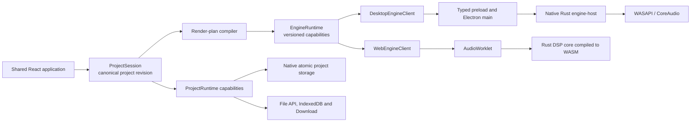
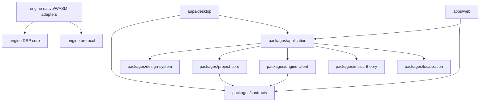

# Tiempio — target architecture

## Status

This document defines the target architecture for the first production foundation of Tiempio.
It translates the product concept and UX prototype into executable application boundaries. It
does not declare the complete music studio implemented; delivery stages are owned by
`docs/project-plan/APPLICATION_SKELETON.md`.

The architecture is based on these repository sources:

- `docs/electronic_music_studio_concept(1).md`;
- `docs/tiempio_ux_path.md`;
- `docs/tiempio_ux_prototype.html`;
- `docs/ableton_scales_harmony_cheatsheet.html`.

Yinkie is read-only reference material. Tiempio adopts its proven toolchain, process isolation,
runtime-capability, design-token and lifecycle patterns where they fit. It does not inherit
Yinkie's Markdown domain, document editor, workspace model or editor dependencies.

## Executive summary

Tiempio is one music product with two application targets, one canonical project model and one
DSP implementation:

- **Desktop** is the complete local studio. Electron provides the secure application shell,
  native persistence and operating-system integration. A separately supervised native engine
  process owns real-time audio, MIDI and device handling.
- **Web** is a deliberately bounded single-project experience. It uses the same React
  application, project model and DSP core, compiled to WebAssembly and hosted in an
  `AudioWorklet`. Browser capabilities determine persistence and audio behavior honestly.
- **Shared application code** owns the musical project revision and product UX. It never imports
  Electron, native filesystem APIs, a child-process transport or browser-hosting internals.
- **The audio engine** is a projection and executor of project state. It does not own project
  persistence or become a second mutable project authority.

The core architecture rule is:

> React expresses musical intent, `ProjectSession` owns musical content, and the engine owns the
> real-time clock and sound.

## Product invariants

The following rules are non-negotiable across implementation stages.

1. A selected musical role produces a playable instrument without manual routing.
2. There is one canonical revision of an open project. UI surfaces and the engine are projections
   of that revision, not independent content stores.
3. The real-time transport clock is engine-owned. React timers are never a scheduling authority.
4. Shared Audio is the safe default wherever the platform supports it. Low-latency modes are
   explicit capabilities and are never enabled silently.
5. If an input signal is observed but sound is not produced, Tiempio reports a stable reason and
   one applicable recovery action.
6. Project files retain enough resolved synthesis state to reproduce their sound after preset
   catalogs or macro mappings evolve.
7. Web limitations are represented by capabilities. Download, browser permission and native
   atomic save are never presented as equivalent guarantees.
8. Desktop renderer code never receives native filesystem paths, raw Node APIs, raw Electron IPC
   objects or native engine process handles.
9. The audio callback performs no allocation, blocking synchronization, filesystem access,
   logging or UI work.
10. Only the current project model can be loaded or recovered. Any other project data fails closed
    at the boundary and is never retained as a hidden alternate format.
11. User audio, project names, paths and musical content never enter analytics or network requests
    without a separately approved product and privacy decision.
12. Windows ships first, while path, lifecycle, packaging, shortcuts and audio abstractions remain
    macOS-compatible from the first foundation.
13. A built-in sound ships only after deterministic defect/behaviour analysis and level-matched
    human desirability review. Numeric validity, loudness or a preset name alone cannot certify
    musical quality.
14. Blank and sound-first projects contain no authored placeholder notes, drum events or song
    instances. Bundled musical examples are explicit immutable content and open only as fresh
    user-project copies.
15. Audio export captures one current in-memory project revision and renders its finite song plan
    through the shared offline DSP core. It never substitutes the last saved file, upper brick
    preview state, a target-specific demo renderer or a network service.
16. External import is an explicit staged conversion of untrusted files. Analysis and mapping do
    not mutate the project; one validated commit creates bounded canonical content, and no
    undocumented proprietary DAW format is parsed without a separate legal/technical approval.
17. Personal audio has explicit intent. `Инструмент из звука` is note-triggered; `Аудиофраза`
    preserves a continuous imported or microphone-recorded performance. Tiempio never infers this
    distinction from duration/pitch, silently transcribes a phrase to MIDI or commits an unfinished
    take. The recorder UI requires explicit user-approved design before implementation.

## System map



## Technology baseline

### Shared application and targets

The initial JavaScript/TypeScript baseline follows the pinned Yinkie stack at the time this
architecture was approved:

- Electron and Electron Builder for the desktop application and packages;
- electron-vite for desktop main, preload and renderer builds;
- Vite for the independent static Web target;
- React 19 and TypeScript 5.9 for the shared application;
- semantic CSS custom properties and application-owned components rather than a general-purpose
  UI framework;
- Lucide for conventional interface symbols, supplemented by Tiempio-owned music symbols;
- the Node test runner for TypeScript unit and policy tests;
- one npm dependency lock for both application targets.

Exact dependency versions are pinned in the skeleton stage. Updating to a newer release is a
separate measured change, not an incidental side effect of scaffolding.

### Audio engine

The audio engine uses a Rust workspace because the same deterministic DSP must serve a native
real-time host, an offline renderer and WebAssembly without depending on the JavaScript event loop.
The foundation contains:

- a platform-neutral DSP core;
- typed render-plan and control protocol types;
- synthesizer and drum synthesis modules;
- a native host executable;
- a WebAssembly `AudioWorklet` adapter.

The first native backend targets Windows shared audio and macOS CoreAudio. A library abstraction
such as CPAL may bootstrap device access, but it is not allowed to erase backend capabilities or
prevent a dedicated WASAPI/CoreAudio implementation when latency and coexistence measurements
require one.

## Repository topology

```text
apps/
  desktop/
    main/
      engine/
      persistence/
      audio-devices/
    preload/
    renderer/
      runtime/
  web/
    bootstrap/
    runtime/
      persistence/
      audio/

packages/
  application/
    src/
      app/
      features/
        home/
        first-layer/
        sound-chooser/
        piano-roll/
        drums/
        arrangement/
        sound-sculpt/
  contracts/
  project-core/
  project-format/
  engine-client/
  music-theory/
  design-system/
  localization/

engine/
  Cargo.toml
  crates/
    protocol/
    core/
    dsp/
    synth/
    drums/
    offline-render/
    native-host/
    web-worklet/

content/
  presets/
  patterns/

scripts/
  lifecycle/

docs/
  architecture/
  project-plan/
  evidence/
```

The initial foundation uses one root `package.json`; source directories are not independently
published packages. Import-policy tests enforce ownership. The Rust workspace has one
`Cargo.lock`. Desktop and Web are always built from the same shared source revision.

## Dependency direction



Rules:

- shared packages do not import `apps/desktop`, `apps/web`, Electron, Node filesystem or browser
  persistence implementations;
- `packages/application` depends only on public package boundaries;
- the desktop renderer reads the preload API in exactly one adapter module;
- the Web bootstrap constructs `WebRuntime` and mounts the same application;
- native project persistence remains native and is not weakened into a lowest-common-denominator
  filesystem interface;
- the engine has no dependency on React, Electron, file dialogs, project-window state or
  localization.

## State authorities

### Project authority

`ProjectSession` owns:

- the canonical immutable project snapshot;
- a monotonically increasing project revision;
- last persisted revision and target fingerprint;
- dirty, saving, recovery, conflict and error state;
- semantic commands and undo/redo history;
- selection-independent musical data.

Every user mutation is a typed command. Commands validate IDs, timing, ranges and invariants before
producing a new snapshot. UI selection, open popovers, zoom and scroll position are presentation
state and do not mutate the project revision.

Event sourcing is not part of the foundation. The durable format is a current validated snapshot;
undo is an in-memory command history and recovery persists revisioned snapshots.

### Presentation authority

An application-owned presentation store retains editor state that must survive component unmounts
without becoming musical project data. Source-editor viewport state is keyed by stable source layer
ID, never by a React component instance or song-instance placement:

```text
SourceViewportState
  sourceLayerId
  manualPlayheadTick
  timeAnchorTick
  pitchAnchor
  horizontalZoom
  verticalZoom
  followPreference
```

Editor chrome has a separate scope from source viewport state:

```text
EditorChromeState
  songDockExpanded
  musicalContextInspectorExpanded
  compactMusicalContextOpen
```

`songDockExpanded` and `musicalContextInspectorExpanded` are independent even when both use the
same shared disclosure component. The inspector's wide-layout preference may be initialized from
and written to bounded target-local user settings because it represents learned UI density, not a
particular brick. Compact drawer/sheet openness is transient and defaults closed; it does not
overwrite the desktop preference. Neither value is keyed by source layer or stored in `.tiempio`.

Time and pitch anchors are semantic musical coordinates. Raw pixel offsets may be cached for the
current layout but cannot be authoritative because DPI, zoom, container size and responsive
presentation change. Switching source layers snapshots the outgoing semantic viewport and restores
the incoming source only after its layout is measured. It must not flash another source's viewport
or auto-fit a previously visited brick.

This store has no project command, revision, dirty flag, Undo entry or engine render-plan field.
Restoration for the lifetime of an open project session is required. A bounded target-local cache
may optionally restore it after reopen by project/source identity, but its absence, eviction or
corruption falls back to a content-aware default and never changes `.tiempio` bytes.

All linked song instances of one source share that source's editor viewport. An explicit variation
receives a new source identity and independent viewport after any one-time initialization copy.
Deletion prunes orphaned viewport entries, and an invalid anchor clamps to the versioned time/pitch
domain without mutating source notes.

### Contextual brick-creation authority

The approved creation contract is defined in
[`STAGE-7A-CONTEXTUAL-BRICK-CREATION.md`](../project-plan/STAGE-7A-CONTEXTUAL-BRICK-CREATION.md).

`LayerCreationCoordinator` is application workflow authority for one bounded draft per open
project session. Role, candidate name, preset/kit, semantic macros and performance mapping remain
inside a separately namespaced draft until final confirmation. Draft IDs cannot be used as
canonical layer/source IDs.

Opening, editing, suspending, resuming or cancelling a draft creates no project command, revision,
dirty state, recovery snapshot, render-plan entry or Undo history. The coordinator also owns focus
return and draft-audition cleanup when an existing source is selected, the project changes, the
window blurs or the view unmounts.

`Use sound`, `Use kit` or an equivalent final action dispatches one validated grouped project
transaction that allocates canonical IDs and creates the complete source/layer. Sound or kit
selection alone creates no authored notes, drum events or song instances. An explicitly selected
named rhythm may copy its visible editable events in the same final transaction. One Undo removes
that complete addition. A revision/limit/validation failure leaves the transient draft available
and exposes no half-created canonical source.

Sound Chooser accepts an explicit target union. An `existing-source` target may preview and commit
canonical source changes; a `creation-draft` target updates only the coordinator and auditions a
bounded transient resolved patch. Components never infer the target from a nullable selected layer.

### Starter-content authority

The Stage 11 contract is defined in
[`STAGE-11-STARTER-CONTENT.md`](../project-plan/STAGE-11-STARTER-CONTENT.md).

`StarterContentCatalog` is immutable, versioned application content. It may contain validated
example-project assets, editable drum-pattern definitions, localization keys, compatibility
metadata, content hashes and rights/provenance records. It is not a `ProjectSession`, persistence
target, recent-project entry, Undo history or engine authority.

`Начать с примера` validates one catalog asset, allocates a fresh project and persistence identity,
and clones the asset into a new ordinary `ProjectSession`. The populated clone becomes that
session's initial history baseline: it is unsaved, starts stopped and has no Undo entry for loading
the template. Repeated openings never share mutable snapshots. Catalog revision changes cannot
rewrite a saved or already open user copy.

`Новый трек` and `Начать со звука` use production empty factories that cannot import starter or
fixture data. A synth source begins with zero notes, and a kit-only drum source begins with zero
events. Selecting a named drum pattern is a separate explicit project command that copies bounded
visible events into the source; the source then owns them independently of the catalog.

The catalog pins the current project schema and resolved instrument/catalog contract, is hash-checked at
build and load boundaries, and fails closed without replacing the current project. The engine only
receives the ordinary render plan compiled from a successfully created user session. There is no
starter-specific scheduler, playback transport or DSP path.

Every shipped musical example and rhythm definition has an immutable provenance record. The
baseline example is independently human-authored for Tiempio, uses no external sample/MIDI/loop and
documents rights for both its composition data and any retained render. Content similarity review
and legal escalation are release gates; the catalog never describes content with the unverifiable
claim that coincidental similarity is impossible.

### Engine authority

The engine owns only volatile playback facts:

- current audio clock and playhead;
- independent generation-bound local cursors for every enabled brick preview source;
- device/backend state and negotiated sample configuration;
- scheduled voices and active note state;
- real-time meters, CPU load and underruns;
- current audio mode and measured latency;
- capture timestamps for MIDI and live input.

The engine acknowledges the project revision represented by its active render plan. A stale
acknowledgement, diagnostic or offline-render result cannot replace state associated with a newer
revision.

### Settings authority

Application settings and live audio-device state are separate:

- persisted preferences may express a desired output, buffer policy or theme;
- the engine reports the active device and actual negotiated audio configuration;
- UI never displays a requested device or low-latency mode as active until engine acknowledgement.

Desktop stores validated current settings under application data with atomic replacement. Web
stores the same bounded snapshot in IndexedDB and degrades explicitly if browser storage is unavailable.

## Project domain model

The approved composition model uses stable opaque IDs, integer musical time and a strict boundary
between reusable source material and its placements in the song. The full AS-TO-BE contract is
recorded in
[`STAGE-10-LINKED-BRICKS-AND-SONG.md`](../project-plan/STAGE-10-LINKED-BRICKS-AND-SONG.md).

```text
Project
  schemaVersion
  projectId
  engineModelVersion
  title
  transport
    tempoMap
    meterMap
    key
    ticksPerQuarter
  sections[]
  layers[]
  song
    instances[]
  assets[]

Layer                         # one reusable source brick in the baseline
  id
  role: rhythm | bass | harmony | melody | custom | reference
  name
  gain
  pan
  muted
  solo
  source: SynthSource | DrumSource | SampleInstrumentSource | AudioPhraseSource | ReferenceSource
  material: MidiBrickMaterial | DrumBrickMaterial | AudioBrickMaterial

MidiBrickMaterial
  materialLengthTicks
  tailRestTicks
  notes[]

DrumBrickMaterial
  materialLengthTicks
  tailRestTicks
  pattern
  events[]

AudioBrickMaterial
  materialFrames
  tailRestFrames

SampleInstrumentSource
  assetId / rootPitch / trimFrames
  playbackMode / gain / envelope / approvedTransposeRange

AudioPhraseSource
  assetId / trimFrames / gain / envelope
  timeBehavior: fixedSamples

SongInstance
  id
  sourceLayerId
  startTick
  durationTicks
  sourceOffsetTicks
```

Musical positions and durations use integers at a versioned PPQ resolution. Floating-point seconds
are derived playback values and are never the source of saved note placement.

An `AudioPhraseSource` is the deliberate exception for source-internal duration: its selected
performance and tail pause use integer audio frames because project tempo must not stretch or
rewrite it. A song instance still starts at an integer song tick. At render-plan compilation that
tick resolves to a sample origin, after which the phrase repeats by exact source frames plus its
explicit tail; tempo changes move tick-anchored starts but do not alter phrase audio.

The layer ID is the brick/source identity in the first implementation. An ordinary song duplicate
creates another `SongInstance` referring to that ID; it never copies notes or sound state. An
explicit independent variation duplicates the source layer and receives a new ID. This keeps the
approved one-brick-per-layer UI simple without conflating source content and arrangement placement.

Layer `muted`/`solo` remain persistent song-mix properties. The beginner-facing speaker in the
upper source editor belongs to a transient brick-preview session and must not mutate those fields.

The role is a product concept, not an audio routing primitive. A role selects safe defaults,
recommended range, editor and initial instrument, while the stored source retains the exact
technical patch needed by the engine.

### Reproducible instrument state

An instrument stores:

- stable preset identity and preset revision;
- semantic macro values such as brightness, hardness and dirt;
- current macro-mapping marker;
- resolved current DSP patch.

The resolved patch is authoritative for sound reproduction. Preset and macro metadata preserve
the understandable UI and allow later editing. Catalog updates do not silently alter existing
projects.

### Perceptual sound-quality authority

The Stage 8 catalog and DSP contract is defined in
[`STAGE-8-PERCEPTUAL-SOUND-QUALITY.md`](../project-plan/STAGE-8-PERCEPTUAL-SOUND-QUALITY.md).
It separates three authorities:

1. the **offline sound lab** renders deterministic stimulus matrices, computes objective
   descriptors and explores bounded candidate parameters;
2. the **reviewed catalog** owns stable preset identity/revision, role/range metadata, explicit
   semantic macro curves and resolved patch seeds;
3. the **human acceptance record** owns randomized level-matched preference, role-fit, fatigue and
   artifact decisions that metrics cannot make.

The offline lab and listening-study tooling never enter renderer, native-host or AudioWorklet
runtime bundles. Runtime DSP consumes only a bounded validated resolved patch. Native and WASM use
the same oscillator, nonlinear, envelope, filter, expression and optional space primitives; a
Desktop-only higher-quality preset path is prohibited.

Objective catalog evidence covers true peak/loudness, DC/non-finite/guard clamps, pitch,
intended-harmonic versus alias energy, timbre descriptors, attack/release, stereo/mono behaviour,
role-register/velocity spread, polyphony and callback cost. These measurements identify defects and
make trials fair; they do not optimize “beauty” as one scalar. Blind target-creator desire-to-use
and trained artifact review remain mandatory.

Semantic macros map perceptual intention to multiple DSP parameters through explicit nonlinear
curves. Frequency/time controls use perceptually appropriate logarithmic/exponential mapping,
blends use bounded equal-power or equivalent curves and audible level is compensated where a
brighter/dirtier/wider result would otherwise win only by gain. Per-preset mappings must be
continuous and directionally correlated with their named descriptor across the reviewed role
range. All reachable macro corners remain subject to the same artifact/headroom/mono gates as the
default.

Catalog production may use deterministic Sobol/Latin-hypercube exploration and multi-objective
ranking offline, but automated search cannot approve or publish a sound. Weak/duplicate entries are
improved, merged or removed; catalog count is not a domain invariant.

The existing procedural drums are a positive reference and remain under regression/mix evidence.
Their implementation changes only for a demonstrated defect or a level-matched preferred
candidate, never merely because the synth patch contract changes.

Any accepted oscillator, nonlinearity, expressive response, topology or effect addition updates the
patch and protocol contracts together before the source-material freeze. The MVP contains one
current synth path and one preset registry. Development fixtures and seed projects are generated
from that catalog.

### Project format

The target `.tiempio` format is a versioned ZIP container:

```text
project.json
assets/<content-hash>
metadata/peaks.json
```

Built-in instruments store parameters, not rendered audio. Imported and microphone/input-recorded
personal audio is stored as a content-addressed asset with validated metadata; a saved project never
depends on the original path, browser handle or unfinished take storage. Waveform peaks and other
derived artifacts are rebuildable caches, never content authority.

Desktop project writes stream to a unique sibling temporary archive, flush it, atomically replace
the destination and revalidate the last observed fingerprint. Large unchanged assets should be
stream-copied rather than decoded into renderer memory.

Web reads an explicitly selected file snapshot or writable handle. Direct persistence is offered
only while current permission exists. A browser download produces `download-requested`, not
`persisted`, and therefore does not acknowledge the saved revision or discard recovery.

Three versions evolve independently:

- `projectSchemaVersion` for serialized musical content;
- `engineProtocolVersion` for app/engine communication;
- `patchModelVersion` for sound-generation behavior.

## Render-plan and engine protocol

The engine never receives React state or platform transports. The application compiles a validated
project revision into a render plan containing:

- transport and tempo data;
- active layer and bus graph;
- bounded reusable source programs with MIDI and drum events in integer musical time;
- song instances referencing those source programs by stable layer ID;
- resolved instrument patches;
- automation blocks when that feature is introduced;
- immutable decoded-asset references;
- export inclusion flags, including reference-track exclusion.

Control-plane messages are versioned and bounded. The initial protocol includes:

- handshake and capability negotiation;
- configure/start/stop audio;
- load full render plan;
- apply revision-bound delta;
- play, stop, seek and loop;
- start/stop/enable/disable and source-local seek for keyed brick-preview cursors;
- ephemeral note-on/note-off audition;
- engine-clock performance recording start/stop and applied-input acknowledgements;
- preview and commit macro changes;
- request diagnostics and device refresh;
- start/cancel offline render;
- graceful shutdown.

The engine has two playback schedulers over the same compiled source programs. Song transport
schedules instances at authored song positions. The keyed brick-preview scheduler owns independent
source cursors and starts a newly enabled brick at source tick zero. Starting one playback authority
stops the other; this is not represented as a saved UI mode.

Each enabled preview source has an independent generation, start frame, local tick and cycle
iteration. Disabling one source removes only its cursor and voices. A source-local seek can suspend
and reposition that source without seeking song transport or changing another preview cursor.

Engine events include:

- ready and capabilities;
- render-plan revision acknowledgement;
- throttled transport and meter snapshots;
- bounded per-source preview cursor snapshots carrying source ID, generation, local tick, cycle
  iteration, engine frame, plan revision and sequence;
- active-device changes;
- captured keyboard, pointer and future MIDI events with engine-clock sample/tick timestamps;
- structured diagnostics;
- offline-render progress and completion;
- fatal protocol or engine failure.

No audio sample stream crosses Electron IPC. UI-facing transport/meter updates are coalesced to an
appropriate visual rate. The renderer interpolates between engine snapshots for animation without
becoming the clock authority.

Preview-cursor interpolation follows the same rule but is keyed by source ID and generation. A
disabled source has no moving cursor, and stale/reordered snapshots cannot animate it after stop or
re-enable. The UI never substitutes the global song transport tick for a missing source cursor.

## Real-time engine rules

The audio callback must:

- allocate nothing;
- take no blocking locks;
- perform no I/O or logging;
- use preallocated voices and buffers;
- receive parameter changes through bounded queues or atomic/triple-buffered snapshots;
- swap render graphs only at safe audio-block boundaries;
- smooth audible parameters to prevent zipper noise;
- produce a defined safe output on invalid data or overload.

The engine has explicit ceilings for voices, events per block, graph nodes, automation points,
asset duration, channels and decode memory. Hitting a ceiling yields a stable diagnostic and a
controlled fallback, not an unbounded allocation or UI freeze.

## Performance recording authority

The full AS-TO-BE contract is defined in
[`STAGE-9B-PERFORMANCE-RECORDING.md`](../project-plan/STAGE-9B-PERFORMANCE-RECORDING.md).
Sound Chooser remains audition-only. Recording begins only in an editable source brick after
`Use sound`.

The engine owns count-in, the recording cursor and the applied sample frame for note-on, note-off
and Stop. It maps those frames to integer source ticks. DOM timestamps and React animation are never
canonical musical time.

An application-owned `PerformanceRecordingCoordinator` pairs applied events by recording and
audition ID, reconciles a live projection and dispatches source commands into `ProjectSession`.
Commands apply automatically during the pass under one explicit history group. Stop closes held
notes and ends that group; it is not a take-confirmation or save action.

Recording is linear overdub at the exact source playhead:

- existing notes remain and overlapping/same-pitch notes are valid;
- input never waits for the first played note to choose its start time;
- source material grows through played notes and recorded silence without wrapping at its old end;
- ordinary horizontal scrolling remains presentation-only;
- the engine monitor snapshot remains fixed during a pass so newly canonical notes do not sound a
  second time; the newest render plan publishes after Stop.

Laptop keys use configured velocity. Touch/pen pressure is normalized at note-on when the platform
honestly supplies it; mouse and constant-pressure devices use an explicit fallback. A later MIDI
adapter uses the same normalized source-ID, pitch and velocity contract and maps device timestamps
to the engine clock.

Native and Web real-time paths expose one versioned, bounded recording capability. Audio callbacks
hold only preallocated cursor/input state and bounded queue messages; pairing, project commands,
history and recovery never execute on the callback.

## Personal audio import and capture authority

The Stage 12 contract is defined in
[`STAGE-12-PERSONAL-AUDIO.md`](../project-plan/STAGE-12-PERSONAL-AUDIO.md).

This authority is separate from keyboard/touch **performance recording**, which records note events.
Personal audio instead produces portable PCM-backed sources through two acquisition paths:

- `Мой звук` validates one user-selected WAV and asks for explicit `Инструмент из звука` versus
  `Аудиофраза` intent;
- `Запись` captures microphone/audio-input frames into an `Аудиофраза` through a dedicated screen.

`PersonalSoundImportCoordinator` owns file selection, bounded validation/decode, intent, trim and
preview. `AudioCaptureCoordinator` owns explicit permission, one input/capture generation, segmented
temporary take, clock/overrun diagnostics and review. Neither coordinator is project authority.
Selection, permission, decoding, recording, Stop and take review remain transient; only the approved
`Use sound` or `Use recording` action dispatches one grouped project transaction.

The recorder screen has a mandatory product gate: its controls, count-in, monitoring, in-context
recording, take retention, shortcuts and responsive behavior must be discussed with the user,
captured in AS-TO-BE/UI references and explicitly approved before recorder implementation begins.
Architecture support cannot be used to bypass that approval.

`SampleInstrumentSource` maps one bounded asset across accepted pitches and is driven by ordinary
MIDI brick notes/velocity. `AudioPhraseSource` preserves continuous imported or recorded timing and
uses a waveform editor; it is not transcribed to MIDI. Both use content-addressed `AudioAsset`,
validated trim/gain/envelope and the same native/WASM/offline render contract.

Desktop main owns native paths, input handles, capture supervision and task-owned temporary take
storage. Web uses activated file selection and explicit secure-context input permission with
Worker/target-owned bounded processing. The shared renderer receives opaque capabilities and typed
states, never a path or raw device handle. Neither target uploads bytes or permission/device labels.

Hashing, decode, resample, waveform peaks and capture-segment writes happen outside React and every
real-time callback. An asset must be fully validated and registered as an immutable bounded engine
buffer/stream before an acknowledged render plan may reference it. Callbacks perform no file I/O,
decode, allocation or path lookup. Dropped frames, permission loss, device removal, rate/channel
change and missing assets are explicit failures, not successful silent audio.

## Offline audio export authority

The approved contract is defined in
[`STAGE-13-AUDIO-EXPORT.md`](../project-plan/STAGE-13-AUDIO-EXPORT.md).

`AudioExportCoordinator` is application authority for one bounded transient export job. It captures
the current immutable `ProjectSession` snapshot and exact project revision, compiles a finite export
render plan, resolves persistent source inclusion and requests a target-owned opaque destination.
Editing may continue after capture, but newer revisions cannot enter or be attributed to the active
job.

The coordinator owns preflight, job generation, progress, cancellation, stale-event rejection and
typed user-facing outcomes. It owns no musical data or PCM generation. Job state, progress and
destination handles never enter `.tiempio`, recovery, project dirty state or Undo history.

The Rust offline renderer owns PCM generation. It consumes the same resolved sources, instances,
tempo map, gain, pan and DSP algorithms as song playback, but drives them in bounded blocks without
a real-time backend. Export never executes in React, the live audio callback or the Web
`AudioWorklet` callback. Initial output is deterministic stereo RIFF/WAVE PCM24 or PCM16 at 48 or
44.1 kHz. Compressed formats, stems, mastering and cloud delivery require later plans.

Export range begins at song tick zero and ends at the last finite included instance plus a
versioned bounded tail derived from resolved release/effect state. Reference sources are excluded
by both project and render-plan validation. Persistent `exportIncluded`, gain, pan, mute and solo
apply; transient upper preview speakers, cursors, manual source playheads, recording count-in and
project playback loop state do not.

Desktop main owns the native destination path, overwrite confirmation, sibling temporary output,
atomic completion and exact job-owned cleanup. Shared UI receives only opaque handles. Web offline
WASM runs in a Worker or equivalent bounded non-UI context and streams to a permitted writable
handle when available; otherwise it creates a strictly bounded local Blob/Download. No export bytes
or project metadata leave the device.

Every progress/result event is bound to job ID, generation and captured revision. Cancellation,
timeout, target denial, disk/memory ceiling, worker/native crash and finalization failure are
distinct outcomes. Success is impossible until the complete WAV header/data has been finalized;
every other exit removes only proven task-owned temporary resources.

## Interchange import authority

The approved post-skeleton contract is defined in
[`STAGE-16-INTERCHANGE-IMPORT.md`](../project-plan/STAGE-16-INTERCHANGE-IMPORT.md).

`InterchangeImportCoordinator` owns one transient, resumable import draft. It selects files through
target-owned opaque handles, requests bounded metadata/decode jobs, retains user mapping decisions
and produces one immutable `ImportProposal`. Selection, analysis, preview and mapping create no
project revision, dirty state, recovery snapshot, asset or Undo entry.

Format decoders emit versioned neutral records and cannot dispatch project commands. A separate
pure mapper validates every proposed source, event, asset, transport change and song instance
against project ceilings. Only final confirmation allocates canonical IDs and applies one grouped
transaction. Failed or cancelled import exposes no half-created source or asset.

The initial interchange boundary is Standard MIDI File type 0/1 plus bounded uncompressed PCM WAV
stems. MIDI becomes editable source material and finite song instances. WAV stems reuse the already
accepted `AudioPhraseSource`, content-addressed asset, validator/decoder and fixed-sample scheduler;
Stage 16 adds batch alignment/mapping rather than a second audio type. Leading silence and a common
origin preserve stem alignment. Initial audio does not time-stretch when tempo changes.

`Открыть` loads `.tiempio` without conversion; `Импорт` converts supported external material;
`Экспорт` renders Tiempio audio. These are separate application intents and routes.

Ableton migration uses only user-initiated Standard MIDI/WAV exports documented by Ableton. Tiempio
does not parse `.als`, scan for or control Ableton Live, extract factory content, infer device/plug-in
state or imply an Ableton partnership. Direct proprietary-format support requires an official
interchange contract/written permission or a positive jurisdiction-specific legal review plus a
new architecture decision.

Desktop main owns native paths and streaming reads; Web uses activated file/handle selection and
Worker-based bounded parsing. Neither target scans storage or uploads imported bytes. Magic bytes,
structure, arithmetic, event/frame counts, metadata and aggregate project/archive costs are
validated before allocation and again before commit.

## Application runtime boundary

Shared application code consumes one versioned `ApplicationRuntime` made of focused capability
groups:

- projects and persistence;
- imported resources;
- personal-audio selection, decode, input capture and temporary-take support;
- interchange import selection, bounded decode and mapping support;
- engine/audio control;
- offline audio export and opaque target output;
- settings;
- application commands;
- lifecycle;
- optional native window integration.

Availability derives from immutable capabilities. Shared components do not scatter checks such as
`if desktop` or `if web`.

The initial product split is:

| Capability | Desktop | Web |
| --- | --- | --- |
| Built-in synth and drum engine | Native engine host | Same DSP in WASM |
| Piano roll, step sequencer and arrangement | Yes | Yes |
| Curated presets and patterns | Yes | Yes |
| Computer-keyboard audition | Yes | Yes |
| Laptop/touch performance recording | Native engine clock | AudioWorklet engine clock |
| Touch/pen pressure velocity | Platform Pointer Events when reported | Browser Pointer Events when reported |
| Shared Audio | Native shared backend | Browser-managed |
| Explicit low-latency mode | When backend supports it | No |
| Native MIDI devices | Yes | Not promised in first Web release |
| Native device diagnostics | Complete | Browser-bounded |
| Open `.tiempio` | Native file | File API |
| Atomic Save | Yes | Only with a current writable handle |
| Download copy | Secondary | Primary fallback |
| Recovery | Application data | IndexedDB |
| Personal PCM WAV import | Opaque native file streaming and shared validator | Activated File/Worker and shared validator |
| Microphone/audio-input phrase recording | Native supervised capture after approved UI gate | Explicit media permission and target-owned capture after approved UI gate |
| Standard MIDI import | Shared deterministic Stage 16 parser | Same parser in bounded Worker flow |
| Bounded PCM WAV stem import | Stage 16 batch mapping over accepted phrase assets | Stage 16 File/Worker batch flow with strict aggregate cap |
| Large/compressed user-audio import | Deferred | Deferred |
| Advanced routing | Deferred | No |
| Stereo WAV export | Native offline renderer and atomic destination | Worker/WASM; streamed handle or bounded Download |

Web is reduced by platform and product capabilities, not by forking the musical model or shipping
a lower-quality DSP implementation.

## Desktop process responsibilities

### Electron main

Electron main owns:

- single-instance application lifecycle;
- window creation and native integration;
- project registry and opaque project handles;
- paths, dialogs, atomic save, fingerprints and recovery;
- imported-asset validation and archive access;
- opaque audio-input enumeration, permission/capture supervision and task-owned temporary takes;
- native engine-host supervision;
- typed IPC registration and sender validation;
- packaging-aware engine binary resolution.

### Preload

Preload exposes a narrow versioned API. It returns neutral application values and opaque IDs. It
does not expose `ipcRenderer`, filesystem paths, child-process objects or arbitrary channel access.

### Renderer

The renderer owns presentation, `ProjectSession`, command coordination and the shared feature UI.
It communicates with the platform only through the injected runtime.

### Engine supervisor

Electron main launches one native engine host with `shell: false`, a protocol version and an
unpredictable task token. The supervisor owns:

- bounded startup and handshake timeout;
- heartbeats and exact process identity;
- graceful stop with bounded forced cleanup;
- protocol framing and message limits;
- crash reporting and controlled restart;
- reload of the latest render plan after restart.

The engine never becomes the owner of unsaved project data, so an engine crash cannot erase the
current project revision.

## Web runtime

The Web target is static and local-first. It contains no required account, API or cloud storage.

The runtime:

- starts audio only from a valid user activation;
- requests microphone/audio input only from the approved named recording gesture and reports denial,
  revocation, track end and unsupported capture truthfully;
- reports a suspended `AudioContext` as an actionable diagnostic;
- loads the WASM module inside an `AudioWorklet` rather than the main UI thread;
- keeps project bytes and names local;
- feature-detects writable handles and permissions;
- uses versioned bounded IndexedDB settings and recovery;
- retains dirty recovery after Download;
- remains usable when optional storage is unavailable;
- ships with a strict CSP and no application-content network transport.

Web does not pretend to provide native audio-device ownership, low-latency exclusive modes,
filesystem watching or desktop atomicity.

## UI composition and prototype mapping

The authoritative cross-screen adaptation contract is
[`STAGE-14-RESPONSIVE-MOBILE.md`](../project-plan/STAGE-14-RESPONSIVE-MOBILE.md). The stable geometry
below is semantic rather than a demand that every region remain visible at every width: a region may
become a rail, drawer, sheet or focused full-screen surface, but it must keep the same state authority
and must not be duplicated into a second model. Earlier stages still own local overlap, reachability
and focus safety; Stage 14 completes the application-wide tablet, phone and constrained-window pass.

The seven prototype screens are states of one application rather than independent routes:

1. Home and recent projects;
2. empty project and first musical role;
3. sound chooser and audition;
4. melodic/bass piano roll;
5. drum step sequencer;
6. arrangement overview;
7. sound sculpt for the selected instrument.

The stable project geometry is:

- application/navigation rail at the outer left;
- musical layers at the left of the project workspace;
- transport at the top;
- selected editor in the center;
- current musical context or inspector at the right;
- global technical settings outside the creative path.

`Экспорт` is a separate top-level destination in the outer application/navigation rail, alongside
Home and Settings. It is not placed inside the musical layer list or lower song dock and is not
confused with Save/Download `.tiempio`. Opening it preserves the live `ProjectSession` and all
editor presentation state. On compact tablet/phone layouts the same semantic destination may move
into the shared navigation drawer/bar, but it keeps its name, icon, selected state and accessible
route. With no open/exportable arrangement it shows a truthful actionable empty state rather than
a dead unexplained icon.

Stage 16 adds `Импорт` as another top-level rail destination, visually paired with but
semantically distinct from Export. It preserves the open project until one atomic import commit or
an explicit guarded new-project replacement. Its route contains selection, analysis, mapping and
ready states; external file parsing never occurs merely because the navigation item is focused or
hovered.

The selected layer and current user intent choose the central editor. Piano roll, drum grid,
arrangement, mixer and synth internals are not mounted simultaneously without an explicit product
reason.

The first-role/contextual Add list distinguishes `Мой звук` from `Запись`. `Мой звук` opens one-file
selection and the explicit sample-instrument/audio-phrase choice. `Запись` opens a dedicated central
input-capture screen and requests permission only after a named gesture. Existing brick rows and the
lower song are not erased by either draft. The recorder screen may not be implemented until its
AS-TO-BE flow and UI reference have been discussed with and explicitly approved by the user.

The right musical-context inspector is secondary progressive disclosure, not permanent project
geometry. On wide layouts it can collapse to a narrow, always-reachable labelled edge rail and the
central editor receives the released width. On constrained tablet and phone layouts the same
semantic surface opens as an overlay drawer or sheet instead of disappearing or reducing the
editor below its usable minimum. It shares the triangle/chevron disclosure language with the lower
song dock but not its state. Selection, source viewport anchors, playback and recording survive
every transition; opening or closing either surface never mutates project or engine state.

The inspector cannot be the sole host for an enabled editing command. Essential selected-note
actions remain in a persistent contextual action strip or labelled overflow when the inspector is
collapsed. Selecting a note does not force the inspector open. Focus inside a collapsing surface
returns to its disclosure control, hidden descendants are removed from the accessibility tree, and
the shared command registry exposes the same labelled action to pointer, touch, keyboard and
assistive technology.

The full `С чего начнём?` surface is truthful only when the canonical project has zero sources. In
a non-empty project, Add opens a non-modal inline creation card in the persistent brick-list
`ScrollSurface`; it never routes through an empty-project projection. Existing rows, current source
editor and song dock remain available. Selecting an existing source suspends draft audition and
opens that source immediately; the retained card can resume or cancel the draft.

React owns the shell and product state. Timeline surfaces begin with bounded semantic DOM where it
is sufficient. A canvas or worker-backed renderer is introduced only after measured scale requires
it, while keyboard and assistive-technology alternatives remain available.

The melodic source editor is a synchronized two-axis viewport: time scrolls horizontally, pitch
scrolls vertically, the time ruler remains horizontally aligned and the pitch ruler remains
vertically aligned. Wheel/trackpad, touch, shared scrollbars and keyboard commands must reach the
same semantic viewport operations. Scrolling alone never changes source bounds or project state.

When canonical notes overlap the visible time interval but lie outside the visible pitch interval,
the projection layer derives top/bottom edge indicators from those same notes. It does not create a
second note entity. Indicators preserve horizontal timing/duration, aggregate safely when dense,
navigate to the represented pitch range and expose an accessible count/direction. They are
visually and semantically distinct from editable notes, selection, theory guidance and future
generated suggestions.

A whole-brick above/below summary may reveal notes outside both the pitch and time view, but it
cannot project a false horizontal position. Time-aligned ghosts and whole-source summaries remain
separate projection kinds with truthful accessible labels.

Time/pitch projection and note queries are bounded to the viewport plus measured overscan. The
implementation may virtualize either axis after measurement, but canonical notes remain in
`ProjectSession`, and accessibility/navigation alternatives cannot depend on every grid cell being
mounted.

The source playhead is a full-height presentation control. Its visible hairline has a larger
transparent pointer/touch hit target, captures the pointer and maps continuous horizontal movement
through the current scroll/zoom transform to a bounded integer source tick. It is not restricted to
bar/beat DOM markers and does not snap unless the user explicitly enables snapping. Empty-grid/ruler
placement and drag update `manualPlayheadTick` without a project command, render-plan publication,
Undo entry or implicit playback start.

While a source is running in brick preview, the displayed line follows that source's engine cursor.
Grabbing it suspends only that source for the non-scrub baseline; release sends at most one
generation-bound source seek and resumes only if it was already running. Other brick cursors and
song time remain unchanged. Keyboard/assistive-technology manipulation exposes the same semantic
tick operations, while note gestures keep priority where hit regions overlap.

## Design system

Tiempio adopts the prototype's visual direction through its own semantic theme rather than copying
Yinkie component CSS literally:

- warm neutral light surfaces;
- deep graphite dark surfaces;
- one coral accent;
- editorial display typography and restrained sans-serif UI text;
- thin separators, musical lines, points, clips and waveforms;
- quiet motion and soft depth;
- no illustrated tutorial cards, hardware skeuomorphism or decorative gamification.

Theme family and color scheme remain separate concepts, but the foundation ships only the approved
Tiempio family in Light, Dark and System modes. Additional families are added only after a complete
state and accessibility review.

Semantic tokens cover at least:

- background, elevated surface, panel, canvas and paper;
- primary, secondary, muted and disabled text;
- borders and focus;
- accent, selection, success, warning, error and conflict;
- track roles and their redundant icons/labels;
- scrollbar track/thumb/hover/active/corner;
- control hover, pressed, selected and disabled states;
- motion durations and easing.

All dropdowns, popovers, sliders, tooltips and scrollable surfaces use shared application-owned
components. An unthemed native popup is not a production shortcut. Track role, mute, solo, scale,
selection and diagnostics never rely on color alone.

Adaptive geometry uses `rem`, `em`, `ch`, percentages, fractions, container units and dynamic
viewport units with `clamp()`, `min()` and `max()`. Fixed pixels are limited to reviewed technical
boundaries such as hairlines, raster assets, native window APIs and test tolerances.

At constrained widths, right-side context becomes a labelled drawer or tab instead of simply
disappearing. Layers and transport retain keyboard-accessible equivalents. Reduced motion, high
contrast, focus visibility and constrained-height overflow are first-class acceptance states.

## Command and interaction model

One typed command registry owns:

- command identity and localized presentation;
- current availability and disabled reason;
- keyboard shortcut;
- toolbar, contextual and native-menu placement;
- whether the command mutates project state, presentation state or engine state.

Beginner-facing commands use musical intent: repeat after, add rest, transpose octave, change
character, mute layer and create variation. Their handlers still produce precise domain commands.

Command scope is stable and explicit in both identity and presentation. Selected-note
`note.transpose-octave-down/up`, playable-keyboard octave and future whole-source transpose are
different commands with different labels; one visible control cannot silently change among them.
Beginner UI uses localized `Октава ниже/выше` or equivalent language, with `12 semitones` in help,
rather than presenting bare `−8va/+8va` notation as the primary label.

Undo and Redo form a separate history group with standard arrows, named tooltips, current shortcut
and truthful disabled reason. Enabled-looking visual-only controls and permanently disabled
unexplained glyphs are prohibited. Context-specific commands are absent outside their scope or
remain disabled only when the reason is visible on hover, focus and assistive technology.

Creation commands are scoped separately from view navigation and project mutation:

- `creation.open-or-focus`, role choice, Back, suspend, resume and Cancel update the transient
  coordinator only;
- existing-source selection remains available while creation is active;
- final create-and-use dispatches one grouped canonical transaction;
- `studio.first-layer` cannot be used as Add navigation for a non-empty project.

Slider-like controls distinguish preview and commit:

- pointer movement sends bounded ephemeral engine preview deltas;
- a dirty pointer or native keyboard-adjustment gesture commits exactly one validated project
  command; pointer release and blur converge on one idempotent terminal path;
- an unrelated `keyup` never commits a slider, and blur without a pending value is a no-op;
- cancel restores the last committed project value and engine plan;
- stale preview acknowledgements cannot overwrite a newer committed revision.

### Keyboard intent and focus ownership

The approved bug contract and staged acceptance are defined in
[`STAGE-7B-FOCUS-SAFE-AUDITION.md`](../project-plan/STAGE-7B-FOCUS-SAFE-AUDITION.md).

Document-level performance input is owned by one explicitly active surface, not by whichever
presentational child happens to hold DOM focus. The shared input router classifies focus targets by
semantic capability instead of rejecting every HTML `input`:

- character-editing inputs, `textarea`, editable comboboxes, `contenteditable`, shortcut capture,
  modal boundaries and IME composition suppress performance input;
- a focused `input[type="range"]` retains Arrow/Home/End/Page adjustment keys but permits the active
  surface's mapped physical performance codes;
- action controls retain Space/Enter activation while unrelated mapped letter codes may audition;
- unknown editable target types fail closed until explicitly classified.

The router uses physical `KeyboardEvent.code`, accepts only registered mapped codes and calls
`preventDefault()` only after accepting a performance event. A note-off is tied to the source ID
created by its accepted note-on so focus movement before `keyup` cannot leave a held voice. Blur,
visibility loss, unmount and active-surface replacement still perform bounded owned-source cleanup.

The design-system `SemanticSlider` shares the same boundary: only range-editing keys may mark its
keyboard gesture dirty, and pointer, range-key and blur terminals can emit at most one commit. Its
focus remains accessible and uses semantic `focus-visible` theme tokens in light, dark and
high-contrast presentation; application code never removes focus merely to make audition work.

Sound Chooser uses this policy for audition from every non-text control, including Fine Tuning.
The source editor extends the identical policy for audition and recording after `Use sound`; it
must not invent a competing focus rule.

Recording commands are scoped separately from note-edit commands. `KeyR` starts count-in or safely
stops and keeps an active pass; Space stops and keeps during recording; Escape cancels only
count-in, while an already started pass remains automatically committed and is reversed only by
ordinary Undo. Ruler/grid arrows may move the source playhead, but note-focused arrows retain their
existing editing meaning. Shortcut conflicts with remapped performance keys require explicit user
resolution.

## Harmony guidance

`packages/music-theory` is a deterministic, platform-neutral module. It provides:

- pitch-class and interval operations;
- scale membership and chord tones;
- recommended role ranges;
- octave transformations;
- progression and next-note suggestions;
- human-readable explanation data.

Guidance is advisory. Out-of-scale notes remain editable and playable. The theory module neither
mutates the project nor generates audio directly.

## Audio health and no-silent-state contract

The runtime exposes an `AudioHealthSnapshot` containing stable evidence such as:

- backend ready, starting, suspended or failed;
- output device present or lost;
- selected and active audio modes;
- instrument present;
- input signal observed;
- layer/master mute and gain state;
- voice and polyphony state;
- underrun and overload status;
- Web user-activation requirement.

Diagnostics contain a code, severity and applicable action code. Localization happens at the UI
boundary. Examples include enabling browser audio, choosing an output, unmuting a layer, restoring
gain, adding an instrument, returning to Shared Audio or restarting the engine.

The UI never guesses an error from a missing meter animation when the engine can report the actual
cause.

## Persistence, recovery and conflicts

Desktop main owns project paths and a process-wide registry. Every open source is canonicalized so
one project file has one active project authority. Saves validate the last observed fingerprint
before replacement. External modification, deletion, read-only state and destination collision are
separate errors.

Recovery is distinct from Save:

- one checksummed mutable recovery snapshot protects the latest unsaved revision;
- recovery lives under application data or Web origin storage, never beside the project;
- restoring recovery opens a dirty project and still requires explicit Save;
- close waits for the latest bounded recovery barrier;
- a failed Save never discards valid recovery.

During performance recording, every engine-acknowledged note and bounded source-range checkpoint is
a canonical grouped project mutation and participates in recovery. Active coordinator IDs,
count-in, held-source overlays and preview-speaker masks are transient and never serialized. An
interruption finalizes at the last trusted engine tick and leaves the completed grouped pass
Undoable.

Microphone/input capture is different: frames remain in a task-owned take draft through Stop and
review and do not enter project recovery or Undo until `Use recording` commits the audio phrase.
Whether valid unfinished takes receive a separate crash-rescue inbox is a mandatory recorder-design
decision; it must not be implemented by mislabelling a temporary take as saved project content.

Immutable user-facing history and automatic disk autosave are future stages. Their absence must not
weaken the initial recovery and explicit-save contract.

## Security boundaries

The foundation includes:

- Electron sandbox, context isolation and disabled Node integration in renderer;
- strict typed IPC with sender and payload validation;
- denied arbitrary navigation, new windows and permission prompts;
- production CSP for Desktop and Web;
- no raw project-controlled HTML execution;
- archive traversal, entry-count, decompressed-size and compression-ratio limits;
- bounded audio decode duration, channel count, sample rate and memory;
- user-activated input permission, bounded capture duration/segments, overrun detection and exact
  temporary-take ownership/cleanup;
- bounded engine protocol frames and render plans;
- bounded export duration, frames, output bytes, filename metadata and task-owned temporary files;
- bounded external MIDI/WAV bytes, tracks, events, RIFF chunks, frames, metadata and aggregate
  portable-asset cost before import allocation or commit;
- no user content, path or name in logs and analytics;
- signed/notarized native engine binary as part of Desktop distribution gates.

The local native engine is still treated as a process boundary: malformed, stale, oversized or
version-mismatched messages fail closed.

## Performance boundaries

The skeleton establishes measured budgets before feature growth:

- initial Desktop and Web shell sizes;
- lazy feature and engine-client graph boundaries;
- audio callback deadline and underrun count;
- render-plan compilation time;
- input-to-sound latency for native MIDI, computer keyboard and Web activation;
- transport snapshot frequency and renderer long tasks;
- peak memory for project load and bounded assets;
- personal-audio validation/decode time, input-to-capture latency, capture overruns, segmented take
  write throughput and maximum common Desktop/Web take duration;
- offline export throughput, peak memory, UI responsiveness and target output limits;
- external MIDI/WAV inspection, decode/resample, copy and archive-write throughput/peak memory;
- first audible result time from the primary user path.

Audio, packaging and production builds run only through the repository lifecycle owner. Resource-
intensive stages run sequentially and retain progress heartbeats and bounded timeouts.

## Future feature fit

The architecture supports planned growth without implementing it speculatively:

- **Advanced synth:** another editor for the same versioned patch model;
- **automation:** lanes targeting stable parameter IDs in render-plan blocks;
- **additional audio import:** extend the Stage 12 sample/phrase asset boundary beyond bounded PCM
  WAV only through reviewed codec, security, licensing and target-capability gates; Stage 16 batch
  stems reuse rather than redefine that boundary;
- **time stretching:** a new engine node without changing project ownership;
- **reference track:** a separate non-exportable source and bus;
- **effects:** explicit internal render-graph nodes;
- **stems and compressed export:** extensions of the delivered revision-bound stereo WAV pipeline,
  requiring explicit encoder, rights/licensing, UX and resource-budget decisions;
- **catalog expansion:** the established offline sound lab can emit additional reviewed entries
  without weakening the frozen quality, runtime or persistence contract;
- **additional theory guidance:** deterministic `music-theory` capabilities;
- **additional windows:** ownership handoff within one process, not duplicate project sessions.

VST/plugin hosting, cloud sync, accounts, collaboration, generative-AI services and public sharing
are deliberately deferred. Each needs a separate product decision, threat model and architecture.

## Foundational acceptance criteria

The architecture is proven, rather than merely scaffolded, when:

- Desktop and Web mount the same shared application;
- both targets use one project model and one DSP core;
- every retained built-in synth sound clears the versioned objective profile and level-matched
  human desire-to-use/role-fit gate, while procedural drums retain their approved identity;
- the primary `new project -> bass -> Deep -> key press -> audible sound` path works in both
  targets;
- Desktop audio runs outside the renderer and Web audio runs in an `AudioWorklet`;
- the seven prototype states share one `ProjectSession`;
- `Начать со звука` has no hidden musical content, while `Начать с примера` creates a fresh
  editable current project copy through ordinary project, render-plan, persistence and engine paths;
- the versioned starter example and expanded rhythm catalog have deterministic hashes, objective
  and listening evidence, and complete rights/provenance records;
- `Мой звук` truthfully creates either a note-triggered sample instrument or a continuous fixed
  audio phrase, and the separately user-approved `Запись` screen captures input into the same
  portable phrase model without first-sound trimming, hidden transcription or premature commit;
- the dedicated Export destination renders the current captured song revision to valid WAV through
  the same offline DSP authority on Desktop and Web, with truthful target output and exact cleanup;
- a minimal `.tiempio` project round-trips without loss;
- an engine crash does not lose the current unsaved project revision;
- Web and shared bundles contain no Electron or Node filesystem code;
- Desktop preload exposes only the versioned bridge;
- Shared Audio and suspended/unavailable audio states produce truthful diagnostics;
- Light, Dark, compact, standard, ultrawide and constrained-height UI states are usable;
- target boundaries, current protocol markers, current-only project loading and real-time invariants are covered by
  deterministic tests;
- saved resolved patches reproduce after catalog evolution, and no macro-accessible sound can
  bypass the alias, true-peak, mono, continuity or callback-budget evidence;
- lifecycle workflows leave no owned process tree, lock or cleanup quarantine after success,
  failure, timeout or interruption.
