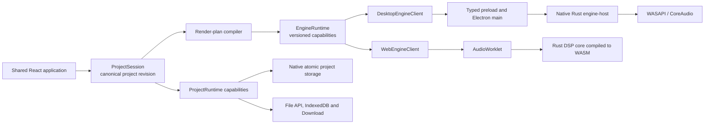
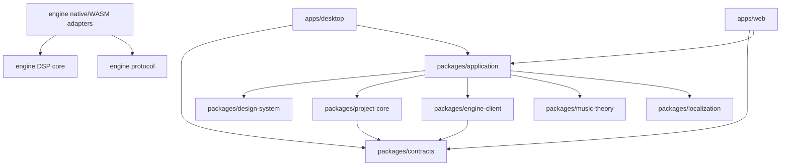

# Tiempio — target architecture

## Status

This document defines the target architecture for the first production foundation of Tiempio.
It translates the product concept and UX prototype into executable application boundaries. It
does not declare the complete music studio implemented; delivery stages are owned by
`docs/project-plan/APPLICATION_SKELETON.md`.

The architecture is based on these repository sources:

- `docs/electronic_music_studio_concept(1).md`;
- `docs/tiempio_ux_path.md`;
- `docs/tiempio_ux_prototype.html`;
- `docs/ableton_scales_harmony_cheatsheet.html`.

Yinkie is read-only reference material. Tiempio adopts its proven toolchain, process isolation,
runtime-capability, design-token and lifecycle patterns where they fit. It does not inherit
Yinkie's Markdown domain, document editor, workspace model or editor dependencies.

## Executive summary

Tiempio is one music product with two application targets, one canonical project model and one
DSP implementation:

- **Desktop** is the complete local studio. Electron provides the secure application shell,
  native persistence and operating-system integration. A separately supervised native engine
  process owns real-time audio, MIDI and device handling.
- **Web** is a deliberately bounded single-project experience. It uses the same React
  application, project model and DSP core, compiled to WebAssembly and hosted in an
  `AudioWorklet`. Browser capabilities determine persistence and audio behavior honestly.
- **Shared application code** owns the musical project revision and product UX. It never imports
  Electron, native filesystem APIs, a child-process transport or browser-hosting internals.
- **The audio engine** is a projection and executor of project state. It does not own project
  persistence or become a second mutable project authority.

The core architecture rule is:

> React expresses musical intent, `ProjectSession` owns musical content, and the engine owns the
> real-time clock and sound.

## Product invariants

The following rules are non-negotiable across implementation stages.

1. A selected musical role produces a playable instrument without manual routing.
2. There is one canonical revision of an open project. UI surfaces and the engine are projections
   of that revision, not independent content stores.
3. The real-time transport clock is engine-owned. React timers are never a scheduling authority.
4. Shared Audio is the safe default wherever the platform supports it. Low-latency modes are
   explicit capabilities and are never enabled silently.
5. If an input signal is observed but sound is not produced, Tiempio reports a stable reason and
   one applicable recovery action.
6. Project files retain enough resolved synthesis state to reproduce their sound after preset
   catalogs or macro mappings evolve.
7. Web limitations are represented by capabilities. Download, browser permission and native
   atomic save are never presented as equivalent guarantees.
8. Desktop renderer code never receives native filesystem paths, raw Node APIs, raw Electron IPC
   objects or native engine process handles.
9. The audio callback performs no allocation, blocking synchronization, filesystem access,
   logging or UI work.
10. Unsupported, invalid or future-version project data fails closed and remains recoverable; it
    is never silently discarded during load or save.
11. User audio, project names, paths and musical content never enter analytics or network requests
    without a separately approved product and privacy decision.
12. Windows ships first, while path, lifecycle, packaging, shortcuts and audio abstractions remain
    macOS-compatible from the first foundation.

## System map



## Technology baseline

### Shared application and targets

The initial JavaScript/TypeScript baseline follows the pinned Yinkie stack at the time this
architecture was approved:

- Electron and Electron Builder for the desktop application and packages;
- electron-vite for desktop main, preload and renderer builds;
- Vite for the independent static Web target;
- React 19 and TypeScript 5.9 for the shared application;
- semantic CSS custom properties and application-owned components rather than a general-purpose
  UI framework;
- Lucide for conventional interface symbols, supplemented by Tiempio-owned music symbols;
- the Node test runner for TypeScript unit and policy tests;
- one npm dependency lock for both application targets.

Exact dependency versions are pinned in the skeleton stage. Updating to a newer release is a
separate measured change, not an incidental side effect of scaffolding.

### Audio engine

The audio engine uses a Rust workspace because the same deterministic DSP must serve a native
real-time host, an offline renderer and WebAssembly without depending on the JavaScript event loop.
The foundation contains:

- a platform-neutral DSP core;
- typed render-plan and control protocol types;
- synthesizer and drum synthesis modules;
- a native host executable;
- a WebAssembly `AudioWorklet` adapter.

The first native backend targets Windows shared audio and macOS CoreAudio. A library abstraction
such as CPAL may bootstrap device access, but it is not allowed to erase backend capabilities or
prevent a dedicated WASAPI/CoreAudio implementation when latency and coexistence measurements
require one.

## Repository topology

```text
apps/
  desktop/
    main/
      engine/
      persistence/
      audio-devices/
    preload/
    renderer/
      runtime/
  web/
    bootstrap/
    runtime/
      persistence/
      audio/

packages/
  application/
    src/
      app/
      features/
        home/
        first-layer/
        sound-chooser/
        piano-roll/
        step-sequencer/
        arrangement/
        sound-sculpt/
  contracts/
  project-core/
  project-format/
  engine-client/
  music-theory/
  design-system/
  localization/

engine/
  Cargo.toml
  crates/
    protocol/
    core/
    dsp/
    synth/
    drums/
    native-host/
    web-worklet/

content/
  presets/
  patterns/

scripts/
  lifecycle/

docs/
  architecture/
  project-plan/
  evidence/
```

The initial foundation uses one root `package.json`; source directories are not independently
published packages. Import-policy tests enforce ownership. The Rust workspace has one
`Cargo.lock`. Desktop and Web are always built from the same shared source revision.

## Dependency direction



Rules:

- shared packages do not import `apps/desktop`, `apps/web`, Electron, Node filesystem or browser
  persistence implementations;
- `packages/application` depends only on public package boundaries;
- the desktop renderer reads the preload API in exactly one adapter module;
- the Web bootstrap constructs `WebRuntime` and mounts the same application;
- native project persistence remains native and is not weakened into a lowest-common-denominator
  filesystem interface;
- the engine has no dependency on React, Electron, file dialogs, project-window state or
  localization.

## State authorities

### Project authority

`ProjectSession` owns:

- the canonical immutable project snapshot;
- a monotonically increasing project revision;
- last persisted revision and target fingerprint;
- dirty, saving, recovery, conflict and error state;
- semantic commands and undo/redo history;
- selection-independent musical data.

Every user mutation is a typed command. Commands validate IDs, timing, ranges and invariants before
producing a new snapshot. UI selection, open popovers, zoom and scroll position are presentation
state and do not mutate the project revision.

Event sourcing is not part of the foundation. The durable format is a current validated snapshot;
undo is an in-memory command history and recovery persists revisioned snapshots.

### Engine authority

The engine owns only volatile playback facts:

- current audio clock and playhead;
- device/backend state and negotiated sample configuration;
- scheduled voices and active note state;
- real-time meters, CPU load and underruns;
- current audio mode and measured latency;
- capture timestamps for MIDI and live input.

The engine acknowledges the project revision represented by its active render plan. A stale
acknowledgement, diagnostic or offline-render result cannot replace state associated with a newer
revision.

### Settings authority

Application settings and live audio-device state are separate:

- persisted preferences may express a desired output, buffer policy or theme;
- the engine reports the active device and actual negotiated audio configuration;
- UI never displays a requested device or low-latency mode as active until engine acknowledgement.

Desktop stores validated settings under application data with atomic replacement. Web stores a
versioned bounded snapshot in IndexedDB and degrades explicitly if browser storage is unavailable.

## Project domain model

The first version uses stable opaque IDs and integer musical time.

```text
Project
  schemaVersion
  projectId
  engineModelVersion
  title
  transport
    tempoMap
    meterMap
    key
    ticksPerQuarter
  sections[]
  layers[]
  assets[]

Layer
  id
  role: rhythm | bass | harmony | melody | custom | reference
  name
  gain
  pan
  muted
  solo
  source: SynthSource | DrumSource | AudioSource | ReferenceSource
  clips[]

MidiClip
  id
  startTick
  lengthTicks
  loop
  notes[]

DrumClip
  id
  startTick
  lengthTicks
  pattern
  events[]
```

Musical positions and durations use integers at a versioned PPQ resolution. Floating-point seconds
are derived playback values and are never the source of saved note placement.

The role is a product concept, not an audio routing primitive. A role selects safe defaults,
recommended range, editor and initial instrument, while the stored source retains the exact
technical patch needed by the engine.

### Reproducible instrument state

An instrument stores:

- stable preset identity and preset revision;
- semantic macro values such as brightness, hardness and dirt;
- macro-mapping version;
- resolved versioned DSP patch.

The resolved patch is authoritative for sound reproduction. Preset and macro metadata preserve
the understandable UI and allow later editing. Catalog updates do not silently alter existing
projects.

### Project format

The target `.tiempio` format is a versioned ZIP container:

```text
project.json
assets/<content-hash>
metadata/peaks.json
```

Built-in instruments store parameters, not rendered audio. Imported user audio is stored as a
content-addressed asset with validated metadata. Waveform peaks and other derived artifacts are
rebuildable caches, never content authority.

Desktop project writes stream to a unique sibling temporary archive, flush it, atomically replace
the destination and revalidate the last observed fingerprint. Large unchanged assets should be
stream-copied rather than decoded into renderer memory.

Web reads an explicitly selected file snapshot or writable handle. Direct persistence is offered
only while current permission exists. A browser download produces `download-requested`, not
`persisted`, and therefore does not acknowledge the saved revision or discard recovery.

Three versions evolve independently:

- `projectSchemaVersion` for serialized musical content;
- `engineProtocolVersion` for app/engine communication;
- `patchModelVersion` for sound-generation behavior.

## Render-plan and engine protocol

The engine never receives React state or platform transports. The application compiles a validated
project revision into a render plan containing:

- transport and tempo data;
- active layer and bus graph;
- MIDI and drum events in integer musical time;
- resolved instrument patches;
- automation blocks when that feature is introduced;
- immutable decoded-asset references;
- export inclusion flags, including reference-track exclusion.

Control-plane messages are versioned and bounded. The initial protocol includes:

- handshake and capability negotiation;
- configure/start/stop audio;
- load full render plan;
- apply revision-bound delta;
- play, stop, seek and loop;
- ephemeral note-on/note-off audition;
- preview and commit macro changes;
- request diagnostics and device refresh;
- start/cancel offline render;
- graceful shutdown.

Engine events include:

- ready and capabilities;
- render-plan revision acknowledgement;
- throttled transport and meter snapshots;
- active-device changes;
- captured MIDI events with engine-clock timestamps;
- structured diagnostics;
- offline-render progress and completion;
- fatal protocol or engine failure.

No audio sample stream crosses Electron IPC. UI-facing transport/meter updates are coalesced to an
appropriate visual rate. The renderer interpolates between engine snapshots for animation without
becoming the clock authority.

## Real-time engine rules

The audio callback must:

- allocate nothing;
- take no blocking locks;
- perform no I/O or logging;
- use preallocated voices and buffers;
- receive parameter changes through bounded queues or atomic/triple-buffered snapshots;
- swap render graphs only at safe audio-block boundaries;
- smooth audible parameters to prevent zipper noise;
- produce a defined safe output on invalid data or overload.

The engine has explicit ceilings for voices, events per block, graph nodes, automation points,
asset duration, channels and decode memory. Hitting a ceiling yields a stable diagnostic and a
controlled fallback, not an unbounded allocation or UI freeze.

Native MIDI is timestamped against the engine clock. Computer-keyboard input is sent as an
ephemeral low-latency command and is added to `ProjectSession` only when recording commits the
captured event sequence.

## Application runtime boundary

Shared application code consumes one versioned `ApplicationRuntime` made of focused capability
groups:

- projects and persistence;
- imported resources;
- engine/audio control;
- settings;
- application commands;
- lifecycle;
- optional native window integration.

Availability derives from immutable capabilities. Shared components do not scatter checks such as
`if desktop` or `if web`.

The initial product split is:

| Capability | Desktop | Web |
| --- | --- | --- |
| Built-in synth and drum engine | Native engine host | Same DSP in WASM |
| Piano roll, step sequencer and arrangement | Yes | Yes |
| Curated presets and patterns | Yes | Yes |
| Computer-keyboard audition | Yes | Yes |
| Shared Audio | Native shared backend | Browser-managed |
| Explicit low-latency mode | When backend supports it | No |
| Native MIDI devices | Yes | Not promised in first Web release |
| Native device diagnostics | Complete | Browser-bounded |
| Open `.tiempio` | Native file | File API |
| Atomic Save | Yes | Only with a current writable handle |
| Download copy | Secondary | Primary fallback |
| Recovery | Application data | IndexedDB |
| Large user-audio import | Yes after bounded decoder stage | Deferred or strictly capped |
| Advanced routing | Deferred | No |
| Offline export | Native | Bounded by browser capability |

Web is reduced by platform and product capabilities, not by forking the musical model or shipping
a lower-quality DSP implementation.

## Desktop process responsibilities

### Electron main

Electron main owns:

- single-instance application lifecycle;
- window creation and native integration;
- project registry and opaque project handles;
- paths, dialogs, atomic save, fingerprints and recovery;
- imported-asset validation and archive access;
- native engine-host supervision;
- typed IPC registration and sender validation;
- packaging-aware engine binary resolution.

### Preload

Preload exposes a narrow versioned API. It returns neutral application values and opaque IDs. It
does not expose `ipcRenderer`, filesystem paths, child-process objects or arbitrary channel access.

### Renderer

The renderer owns presentation, `ProjectSession`, command coordination and the shared feature UI.
It communicates with the platform only through the injected runtime.

### Engine supervisor

Electron main launches one native engine host with `shell: false`, a protocol version and an
unpredictable task token. The supervisor owns:

- bounded startup and handshake timeout;
- heartbeats and exact process identity;
- graceful stop with bounded forced cleanup;
- protocol framing and message limits;
- crash reporting and controlled restart;
- reload of the latest render plan after restart.

The engine never becomes the owner of unsaved project data, so an engine crash cannot erase the
current project revision.

## Web runtime

The Web target is static and local-first. It contains no required account, API or cloud storage.

The runtime:

- starts audio only from a valid user activation;
- reports a suspended `AudioContext` as an actionable diagnostic;
- loads the WASM module inside an `AudioWorklet` rather than the main UI thread;
- keeps project bytes and names local;
- feature-detects writable handles and permissions;
- uses versioned bounded IndexedDB settings and recovery;
- retains dirty recovery after Download;
- remains usable when optional storage is unavailable;
- ships with a strict CSP and no application-content network transport.

Web does not pretend to provide native audio-device ownership, low-latency exclusive modes,
filesystem watching or desktop atomicity.

## UI composition and prototype mapping

The seven prototype screens are states of one application rather than independent routes:

1. Home and recent projects;
2. empty project and first musical role;
3. sound chooser and audition;
4. melodic/bass piano roll;
5. drum step sequencer;
6. arrangement overview;
7. sound sculpt for the selected instrument.

The stable project geometry is:

- application/navigation rail at the outer left;
- musical layers at the left of the project workspace;
- transport at the top;
- selected editor in the center;
- current musical context or inspector at the right;
- global technical settings outside the creative path.

The selected layer and current user intent choose the central editor. Piano roll, drum grid,
arrangement, mixer and synth internals are not mounted simultaneously without an explicit product
reason.

React owns the shell and product state. Timeline surfaces begin with bounded semantic DOM where it
is sufficient. A canvas or worker-backed renderer is introduced only after measured scale requires
it, while keyboard and assistive-technology alternatives remain available.

## Design system

Tiempio adopts the prototype's visual direction through its own semantic theme rather than copying
Yinkie component CSS literally:

- warm neutral light surfaces;
- deep graphite dark surfaces;
- one coral accent;
- editorial display typography and restrained sans-serif UI text;
- thin separators, musical lines, points, clips and waveforms;
- quiet motion and soft depth;
- no illustrated tutorial cards, hardware skeuomorphism or decorative gamification.

Theme family and color scheme remain separate concepts, but the foundation ships only the approved
Tiempio family in Light, Dark and System modes. Additional families are added only after a complete
state and accessibility review.

Semantic tokens cover at least:

- background, elevated surface, panel, canvas and paper;
- primary, secondary, muted and disabled text;
- borders and focus;
- accent, selection, success, warning, error and conflict;
- track roles and their redundant icons/labels;
- scrollbar track/thumb/hover/active/corner;
- control hover, pressed, selected and disabled states;
- motion durations and easing.

All dropdowns, popovers, sliders, tooltips and scrollable surfaces use shared application-owned
components. An unthemed native popup is not a production shortcut. Track role, mute, solo, scale,
selection and diagnostics never rely on color alone.

Adaptive geometry uses `rem`, `em`, `ch`, percentages, fractions, container units and dynamic
viewport units with `clamp()`, `min()` and `max()`. Fixed pixels are limited to reviewed technical
boundaries such as hairlines, raster assets, native window APIs and test tolerances.

At constrained widths, right-side context becomes a labelled drawer or tab instead of simply
disappearing. Layers and transport retain keyboard-accessible equivalents. Reduced motion, high
contrast, focus visibility and constrained-height overflow are first-class acceptance states.

## Command and interaction model

One typed command registry owns:

- command identity and localized presentation;
- current availability and disabled reason;
- keyboard shortcut;
- toolbar, contextual and native-menu placement;
- whether the command mutates project state, presentation state or engine state.

Beginner-facing commands use musical intent: repeat after, add rest, transpose octave, change
character, mute layer and create variation. Their handlers still produce precise domain commands.

Slider-like controls distinguish preview and commit:

- pointer movement sends bounded ephemeral engine preview deltas;
- release, keyboard step or blur commits one validated project command;
- cancel restores the last committed project value and engine plan;
- stale preview acknowledgements cannot overwrite a newer committed revision.

## Harmony guidance

`packages/music-theory` is a deterministic, platform-neutral module. It provides:

- pitch-class and interval operations;
- scale membership and chord tones;
- recommended role ranges;
- octave transformations;
- progression and next-note suggestions;
- human-readable explanation data.

Guidance is advisory. Out-of-scale notes remain editable and playable. The theory module neither
mutates the project nor generates audio directly.

## Audio health and no-silent-state contract

The runtime exposes an `AudioHealthSnapshot` containing stable evidence such as:

- backend ready, starting, suspended or failed;
- output device present or lost;
- selected and active audio modes;
- instrument present;
- input signal observed;
- layer/master mute and gain state;
- voice and polyphony state;
- underrun and overload status;
- Web user-activation requirement.

Diagnostics contain a code, severity and applicable action code. Localization happens at the UI
boundary. Examples include enabling browser audio, choosing an output, unmuting a layer, restoring
gain, adding an instrument, returning to Shared Audio or restarting the engine.

The UI never guesses an error from a missing meter animation when the engine can report the actual
cause.

## Persistence, recovery and conflicts

Desktop main owns project paths and a process-wide registry. Every open source is canonicalized so
one project file has one active project authority. Saves validate the last observed fingerprint
before replacement. External modification, deletion, read-only state and destination collision are
separate errors.

Recovery is distinct from Save:

- one checksummed mutable recovery snapshot protects the latest unsaved revision;
- recovery lives under application data or Web origin storage, never beside the project;
- restoring recovery opens a dirty project and still requires explicit Save;
- close waits for the latest bounded recovery barrier;
- a failed Save never discards valid recovery.

Immutable user-facing history and automatic disk autosave are future stages. Their absence must not
weaken the initial recovery and explicit-save contract.

## Security boundaries

The foundation includes:

- Electron sandbox, context isolation and disabled Node integration in renderer;
- strict typed IPC with sender and payload validation;
- denied arbitrary navigation, new windows and permission prompts;
- production CSP for Desktop and Web;
- no raw project-controlled HTML execution;
- archive traversal, entry-count, decompressed-size and compression-ratio limits;
- bounded audio decode duration, channel count, sample rate and memory;
- bounded engine protocol frames and render plans;
- no user content, path or name in logs and analytics;
- signed/notarized native engine binary as part of Desktop distribution gates.

The local native engine is still treated as a process boundary: malformed, stale, oversized or
version-mismatched messages fail closed.

## Performance boundaries

The skeleton establishes measured budgets before feature growth:

- initial Desktop and Web shell sizes;
- lazy feature and engine-client graph boundaries;
- audio callback deadline and underrun count;
- render-plan compilation time;
- input-to-sound latency for native MIDI, computer keyboard and Web activation;
- transport snapshot frequency and renderer long tasks;
- peak memory for project load and bounded assets;
- first audible result time from the primary user path.

Audio, packaging and production builds run only through the repository lifecycle owner. Resource-
intensive stages run sequentially and retain progress heartbeats and bounded timeouts.

## Future feature fit

The architecture supports planned growth without implementing it speculatively:

- **Advanced synth:** another editor for the same versioned patch model;
- **automation:** lanes targeting stable parameter IDs in render-plan blocks;
- **audio import:** `AudioSource` plus bounded decode and archive assets;
- **time stretching:** a new engine node without changing project ownership;
- **reference track:** a separate non-exportable source and bus;
- **effects:** explicit internal render-graph nodes;
- **offline WAV and stems:** the same DSP core driven without a real-time backend;
- **procedural preset production:** an offline sound-lab tool that emits reviewed catalog entries;
- **additional theory guidance:** deterministic `music-theory` capabilities;
- **additional windows:** ownership handoff within one process, not duplicate project sessions.

VST/plugin hosting, cloud sync, accounts, collaboration, generative-AI services and public sharing
are deliberately deferred. Each needs a separate product decision, threat model and architecture.

## Foundational acceptance criteria

The architecture is proven, rather than merely scaffolded, when:

- Desktop and Web mount the same shared application;
- both targets use one project model and one DSP core;
- the primary `new project -> bass -> Deep -> key press -> audible sound` path works in both
  targets;
- Desktop audio runs outside the renderer and Web audio runs in an `AudioWorklet`;
- the seven prototype states share one `ProjectSession`;
- a minimal `.tiempio` project round-trips without loss;
- an engine crash does not lose the current unsaved project revision;
- Web and shared bundles contain no Electron or Node filesystem code;
- Desktop preload exposes only the versioned bridge;
- Shared Audio and suspended/unavailable audio states produce truthful diagnostics;
- Light, Dark, compact, standard, ultrawide and constrained-height UI states are usable;
- target boundaries, protocol versions, project migrations and real-time invariants are covered by
  deterministic tests;
- lifecycle workflows leave no owned process tree, lock or cleanup quarantine after success,
  failure, timeout or interruption.

