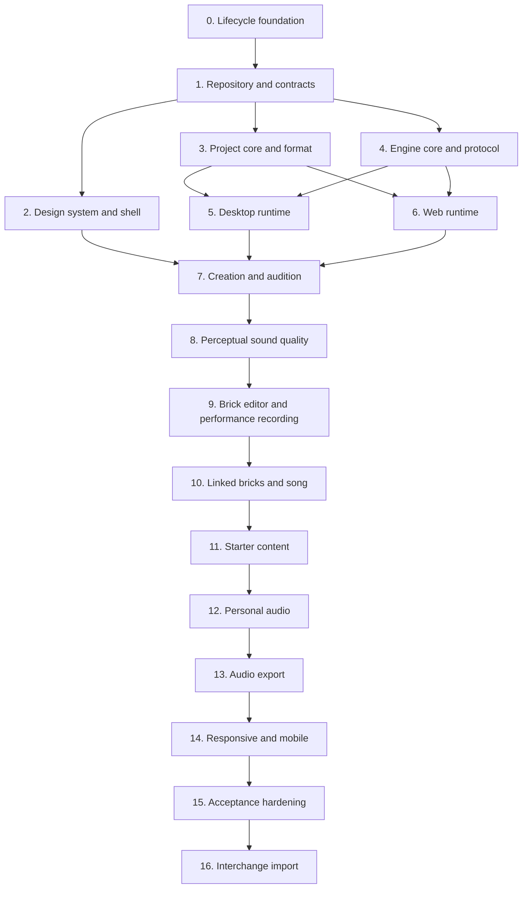

# Tiempio application skeleton — implementation plan

## Status and ownership

**Status:** implementation is complete through Stage 8 on `main`. Stage 9 is complete on the clean
`feature/brick-editor-performance` integration branch and awaits review rather than a merge to
`main`. Retained Desktop hardware/packaged observations remain documented. Stages 10–16 remain
approved plans; Stage 12 recorder UI additionally requires its explicit user design approval before
implementation.

**Original planned integration branch:** `feature/application-skeleton`.

The original integration branch remains at the approved planning baseline. In the local repository,
the reviewed Stage 0-4 task branches were integrated by sequential fast-forwards into `main`, ending
at Stage 4 revision `d835cf9`. That history is retained rather than rewritten. The corrective
architecture alignment before Stage 5 was completed through
`docs/project-plan/ARCHITECTURE-ALIGNMENT.md` on branch `fix/architecture-alignment`; it does not
implement or claim any Stage 5 runtime behavior.

The detailed Stage 5 delivery plan is recorded in
`docs/project-plan/STAGE-5-DESKTOP-RUNTIME.md`. It treats the prototype-exact UI restored at
`9ee5191` as an immutable implementation baseline: Desktop runtime work may activate existing
truthful states, but it may not redesign or visually drift from the approved prototype.

The detailed Stage 6 delivery plan is recorded in
`docs/project-plan/STAGE-6-WEB-RUNTIME.md`. It preserves the same authority and visual boundaries,
adds an activation-gated WASM AudioWorklet plus browser persistence, and reflects the current
composite synth/drum engine rather than creating a Bass-only Web fork.

| Stage | Current state |
| --- | --- |
| 0 - Lifecycle foundation | Complete |
| 1 - Repository and contracts | Complete |
| 2 - Design system and shared shell | Complete; retained evidence exists |
| 3 - Project core and logical format | Complete; retained evidence exists |
| 4 - Engine core and offline proof | Complete; retained evidence exists |
| 5 - Desktop runtime | Implemented; automated acceptance complete, manual Windows hardware and packaged-GUI gates retained |
| 6 - Web runtime | Complete; retained evidence exists |
| 7 - Creation flow and focus-safe audition | Complete; merged into `main` |
| 8 - Perceptual sound quality and curated catalog | Engineering package complete; merged into `main`; human preference follow-up retained |
| 9 - Brick editor and performance recording | Complete on `feature/brick-editor-performance`; fresh unpacked Desktop build retained |
| 10 - Linked bricks and song composition | Approved plan; not started |
| 11 - Empty starts, example song and rhythm library | Approved plan; not started |
| 12 - Personal audio import and microphone recording | Approved architecture; recorder design review required |
| 13 - Dedicated audio export | Approved plan; not started |
| 14 - Responsive, tablet and mobile adaptation | Approved plan; not started |
| 15 - Combined acceptance hardening | Approved plan; not started |
| 16 - Interchange import and safe DAW migration | Approved plan; starts after Stage 15 |

**Architecture authority:** `docs/architecture/TIEMPIO_ARCHITECTURE.md`.

This plan owns the construction of the first real Desktop/Web application skeleton and the
smallest audible end-to-end product slice. It is intentionally narrower than the complete product
concept. Completing this plan proves the architecture and leaves a safe foundation for subsequent
feature phases; it does not claim that Tiempio is already a complete music studio.

## Intended user-visible outcome

At completion, a user can launch Tiempio Desktop or Tiempio Web and follow one honest path:

> New track -> Bass -> Deep -> play from the computer keyboard -> hear the instrument -> record or
> place a source phrase -> arrange linked instances -> play and stop the song -> save or retain the
> project through the target's real persistence capability.

The complete seven-state prototype is represented by the real shared application shell:

1. Home;
2. first musical layer;
3. sound chooser;
4. piano roll;
5. drum sequencer foundation;
6. arrangement foundation;
7. sound-sculpt foundation.

The primary Bass vertical slice proves the path first. In Stage 8, the bounded built-in
five-family synth catalog clears the perceptual sound-quality gate; the current procedural
drums remain the protected positive reference. Arrangement and sound-sculpt surfaces remain
architecture-real and project-state-driven, while broader catalog expansion belongs to later
feature plans.

## Definition of the skeleton boundary

The skeleton includes:

- secure Electron and independent static Web production targets;
- shared React application and Tiempio design system;
- versioned application/runtime and engine contracts;
- canonical revisioned `ProjectSession`;
- minimal `.tiempio` project format and recovery contract;
- Rust DSP core with a mathematically analysed, human-curated built-in synth catalog and the
  protected procedural drum reference;
- native Desktop engine host;
- WebAssembly `AudioWorklet` engine adapter;
- real computer-keyboard audition;
- engine-clock laptop/touch performance recording with automatic grouped Undo;
- open-ended virtual source editing that grows through authored notes or recorded silence;
- bounded local PCM WAV import through `Мой звук` as either a portable sample instrument or fixed
  audio phrase, plus explicitly approved microphone/input recording to the same phrase model;
- engine-owned transport for one short MIDI phrase;
- deterministic full-song stereo WAV export from the current project revision through a dedicated
  application workspace;
- structured audio diagnostics;
- source, unit, boundary, smoke, visual/accessibility and audio acceptance gates;
- repository-owned bounded lifecycle workflows.

The skeleton excludes:

- unbounded catalog expansion, multisampled acoustic instruments and third-party sound libraries;
- large/batch/compressed user-audio import, multisample libraries and time stretching beyond the
  bounded Stage 12 personal-audio boundary;
- Web/native MIDI-device permission, discovery and routing UX; keyboard/touch recording and the
  MIDI-ready normalized event seam are owned by Stage 9;
- advanced synth controls, user-routable/general-purpose effects, automation and user routing; a
  bounded per-instrument space primitive is allowed only if the perceptual sound-quality bake-off
  accepts it as versioned patch data within target budgets;
- mixing and mastering workflows;
- immutable history and automatic disk autosave;
- full reference-track mode;
- compressed export formats, stems, mastering/normalization and cloud publishing beyond the
  initial production stereo WAV mixdown;
- plugins, accounts, cloud sync, collaboration, AI generation and analytics;
- Linux release certification;
- repository-hosted automation under `.github/workflows/`.

Excluded scope must not be represented by fake enabled controls. A visible deferred action is
disabled with a clear reason or omitted according to the current context.

## Delivery method

This is a large task. Work proceeds only in the primary repository worktree.

1. `feature/application-skeleton` was the originally approved integration branch. The implemented
   Stage 0-4 history instead reached local `main` through reviewed task-branch fast-forwards. No
   historical branch pointer is moved to conceal that difference.
2. Every remaining implementation stage uses a separate branch created from an explicit current
   task integration head. Work never starts directly on `main`.
3. A stage branch contains only that stage's scope and atomic English commits.
4. The stage is reviewed and verified before it is merged into the integration branch.
5. Immediately after every commit, the lifecycle lock, cleanup quarantine and exact task-owned
   process identities are audited before any new check, branch, stage, commit or merge.
6. Resource-intensive dependency, Rust build, production build, package and audio acceptance
   commands run sequentially through the lifecycle owner. The user is warned before they start.
7. No work is merged into `main`, pushed or submitted as a pull request without explicit user
   authorization.

Planned stage branches:

```text
feature/skeleton-lifecycle-foundation
feature/skeleton-repository-contracts
feature/skeleton-design-shell
feature/skeleton-project-core
feature/skeleton-engine-core
feature/skeleton-desktop-runtime
feature/skeleton-web-runtime
feature/creation-and-audition
feature/perceptual-sound-quality
feature/brick-editor-performance
feature/linked-bricks-song-architecture
feature/starter-content
feature/personal-sound-import
feature/audio-export
feature/responsive-mobile
feature/stage-15-acceptance
feature/interchange-import
```

If a stage reveals a required architectural change, the integration plan and architecture
document are updated before implementation continues. Scope is not silently redistributed between
branches.

## Dependency sequence



Stages remain sequential in delivery even where the dependency graph would permit parallel coding.
This keeps resource ownership observable and prevents two heavy Node/Rust workflows from running
at once.

## Stage 0 — Lifecycle and repository safety foundation

**Branch:** `feature/skeleton-lifecycle-foundation`.

### Outcome

Every dependency installation, validation, test, build, code-generation and packaging entry point
has one fail-fast lifecycle owner before any of those workflows is introduced or run.

### Work

- Port the proven Yinkie lifecycle mechanism as an isolated engineering mechanism, renaming all
  product-specific identifiers to Tiempio.
- Add a minimal dependency-free root `package.json` and npm lockfile solely to expose and pin the
  Stage 0 lifecycle entry points. Application dependencies remain Stage 1 scope.
- Define one closed workflow catalog with direct executable and argument vectors.
- Launch children with `shell: false`.
- Add a repository-wide single-run lock containing owner PID, creation identity, workflow token,
  active stage and observed descendants.
- Add per-stage timeouts, progress heartbeats and a bounded whole-workflow deadline for composite
  gates.
- Forward SIGINT/SIGTERM/Windows interruption into the same exact-tree cleanup path used by failure
  and timeout.
- Prove ownership using PID, creation time, executable, command line, parent chain and task token;
  never kill by executable name.
- Preserve the lock and write a cleanup-required quarantine when process identity or cleanup cannot
  be proven.
- Add a read-only post-commit audit over the last-run journal, lock and quarantine.
- Reject direct `npm install`/`npm ci` lifecycle hooks and expose owned install workflows.
- Add Cargo commands to the same lifecycle catalog; Cargo is not permitted to become an opaque
  second lifecycle owner.
- Keep only documented interactive development processes as explicit long-lived exclusions.

### Verification

- Deterministic fake-process tests cover success, failure, timeout, interruption, duplicate lock,
  stale lock, PID reuse, foreign descendants, orphan after successful stage and cleanup failure.
- Static policy proves that every bounded process-creating script reaches the owner.
- A deliberately failed harmless fixture proves lock cleanup and no surviving task-owned process.
- `lifecycle:audit` passes after the stage commit.

### Exit criteria

- No dependency or build command is needed to test the initial Node-built-in lifecycle core.
- All future heavy workflow names are reserved in the closed catalog.
- The lifecycle owner can safely run Node and Cargo stages sequentially.
- No lock, quarantine or task-owned descendant remains after every fixture path.

## Stage 1 — Repository topology and versioned contracts

**Branch:** `feature/skeleton-repository-contracts`.

### Outcome

The repository contains two empty production composition roots and shared public contracts with
enforced dependency direction.

### Work

- Expand the pinned root `package.json` and npm lockfile with application dependencies, then add
  TypeScript project configs plus ESLint and Prettier configuration.
- Add the root Rust workspace, pinned toolchain declaration and Cargo lockfile.
- Create `apps/desktop`, `apps/web`, shared `packages` and `engine/crates` topology from the
  architecture document.
- Add Electron Vite and independent Web Vite configurations with separate output directories.
- Define `ApplicationRuntime` capability groups for projects, resources, engine/audio, settings,
  commands, lifecycle and optional platform integration.
- Define neutral application error codes and discriminated persistence outcomes.
- Define `engineProtocolVersion`, handshake, bounded command/event envelopes and stable diagnostic
  codes in one schema authority consumed by TypeScript and Rust.
- Add generated-code policy if protocol bindings are generated. Generated files must be
  deterministic and updated only through the lifecycle owner.
- Add static target-boundary rules:
  - shared code cannot import Desktop or Web;
  - Web cannot import Electron, Node filesystem or Desktop transport;
  - Desktop renderer cannot import Electron directly;
  - engine crates cannot depend on application/UI packages.
- Add strict production CSP markers for Desktop and Web.
- Establish initial bundle classes and empty-shell size budgets before feature growth.

### Edge cases

- Runtime or engine protocol version mismatch fails before application/session creation.
- An unavailable capability has a typed result; it is not represented by a throwing placeholder
  hidden behind target checks.
- Web build output cannot enter Desktop `app.asar`.
- Native engine artifacts cannot be loaded from a development-relative path in a package.

### Verification

- Node and Web type checks.
- Rust workspace check.
- Target import-policy tests.
- Production Desktop and Web empty builds.
- Package-content policy fixture proving target artifact separation.
- Bundle attribution and initial budget report.

### Exit criteria

- Both targets build independently from one shared revision.
- Shared contracts expose no Electron, DOM file handle, child-process or native path type.
- Version mismatch and unavailable-capability contract tests pass.
- The worktree and lifecycle audit are clean after the stage merge.

## Stage 2 — Tiempio design system and shared application shell

**Branch:** `feature/skeleton-design-shell`.

### Outcome

Desktop and Web mount the same accessible React shell and represent all seven prototype states
without embedding a second static prototype implementation.

### Work

- Add shared `mountApplication(runtime)` composition.
- Add application runtime, settings, localization and command providers.
- Create the Tiempio semantic theme token registry with the approved family in System, Light and
  Dark modes.
- Convert prototype geometry to semantic relative tokens and container-based layout.
- Implement shared application-owned:
  - icon and text buttons;
  - tooltip;
  - popover;
  - select/dropdown;
  - semantic slider;
  - scroll surface and global scrollbar treatment;
  - focus ring and reduced-motion behavior;
  - Windows custom title controls and macOS integrated-title spacing.
- Build the stable shell: title area, activity rail, project top bar, layer list, central workspace,
  right contextual area and compact fallback drawer.
- Implement typed presentation states for Home, First Layer, Sound Chooser, Piano Roll, Drums,
  Arrangement and Sound Sculpt.
- Use feature view models rather than hard-coded demo HTML so Stage 3 can attach real project data
  without rewriting components.
- Add EN, RU and ES typed catalogs. Musical content and project names are never localized.
- Add one command registry used by controls, DOM shortcuts and future native menus.

### Edge cases

- Compact width and constrained height retain access to context that the prototype visually hides.
- All visible scrollable surfaces use the same scrollbar states.
- Every dropdown has themed trigger, panel, option, selected, hover, focus and disabled treatment.
- Mute, solo, selected track, scale and diagnostics have non-color signals.
- Browser-reserved shortcuts have visible alternatives.
- Tooltips never become the only accessible name.

### Verification

- Component/model tests for command presentation, popover lifecycle and responsive state changes.
- Static theme-token and localization parity policies.
- Light/Dark screenshots at compact, standard and ultrawide viewports.
- Constrained-height overflow assertions.
- Keyboard traversal, focus restoration and reduced-motion checks.
- Desktop custom-title controls and macOS title-spacing unit tests.

### Exit criteria

- One shared shell renders in both targets.
- All seven prototype states are reachable through typed application navigation.
- No target-specific branch exists inside feature components.
- Equivalent controls share one design-system implementation.
- No prototype-only fixed geometry has become a production responsive dependency.

## Stage 3 — Project model, session and minimal format

**Branch:** `feature/skeleton-project-core`.

### Outcome

All prototype surfaces read one validated project snapshot, and project mutations advance one
canonical revision with deterministic persistence round trips.

### Work

- Define versioned project schema with stable IDs and integer PPQ time.
- Implement layers, MIDI clips, minimal drum clips, sections, transport, key and instrument source.
- Define resolved Bass patch, semantic macros, preset revision and patch-model version.
- Implement pure validators for the current project shape.
- Implement `ProjectSession` snapshots with revision, persisted revision, dirty state and typed
  command application.
- Add bounded in-memory undo/redo for semantic commands.
- Implement initial commands:
  - create project;
  - add musical-role layer;
  - select preset/character;
  - update and commit semantic macro;
  - add/move/resize/delete note;
  - transpose octave;
  - set layer mute, solo and gain;
  - set tempo, key and loop;
  - create minimal section and clip placement.
- Keep presentation selection, zoom, scroll and open panels outside project revision.
- Implement logical `.tiempio` archive model and manifest codec.
- Add one checksummed recovery-snapshot contract independent of explicit Save.
- Implement render-plan compilation as a pure revision-bound function.

### Edge cases

- Duplicate/missing IDs, invalid references and cycles fail validation.
- Negative/out-of-range ticks, zero durations and integer overflow fail closed.
- Any project or patch shape outside the current contract fails `open` and is not retained.
- Out-of-scale notes remain valid musical data.
- A mutation during Save leaves the newer revision dirty.
- Preset catalog changes do not change a resolved saved patch.
- Reference layers are excluded from export plans by data, not by UI convention.

### Verification

- Current-schema fixtures.
- Repeated serialize/parse/serialize round trips.
- Property-based or exhaustive bounded command-sequence tests where practical.
- Undo/redo invariants.
- Save-revision race tests.
- Render-plan determinism and stale-revision tests.
- Fuzz or corpus tests for malformed manifests and archive metadata without decoding unbounded data.

### Exit criteria

- The seven shared surfaces can project from one in-memory `ProjectSession`.
- A minimal project round-trips exactly or through one documented canonical normalization.
- Resolved Bass sound state survives catalog changes in fixtures.
- No project mutation exists only inside a React component.
- Recovery and Save acknowledgements are revision-bound and independently tested.

## Stage 4 — DSP core, protocol and deterministic offline proof

**Branch:** `feature/skeleton-engine-core`.

### Outcome

The platform-neutral Rust engine can compile and render the minimal Bass project deterministically
without Electron, Web APIs or a live audio device.

### Work

- Implement bounded protocol frame parsing and handshake types.
- Implement transport clock, tempo conversion and event scheduler.
- Implement preallocated voice pool and note lifecycle.
- Implement one subtractive-synthesis Bass voice and one reviewed `Deep` patch.
- Implement master gain and safe limiter/clip policy sufficient for the slice.
- Implement parameter smoothing and block-boundary render-plan swap.
- Implement ephemeral note-on/note-off audition.
- Implement a deterministic offline block renderer used by tests.
- Expose engine capabilities, revision acknowledgement and audio health diagnostics.
- Add real-time invariant documentation beside the callback boundary.
- Establish explicit ceilings for voices, scheduled events, plan bytes and protocol frames.

### Edge cases

- Note-off for unknown/already-ended voice is harmless and bounded.
- Voice exhaustion applies a documented deterministic voice-stealing policy.
- NaN/infinite/out-of-range patch values fail validation before the callback.
- Tempo, seek or plan changes cannot leave stuck notes.
- Stale plans and deltas are rejected or ignored without replacing a newer active revision.
- Protocol corruption terminates the session safely without undefined audio output.
- Offline rendering is deterministic within the documented floating-point tolerance.

### Verification

- Rust unit tests for oscillators, envelopes, scheduling, voice stealing and smoothing.
- Golden offline waveform/spectrum fixtures with reviewed numeric tolerance.
- Silence/DC/clipping/NaN tests.
- Protocol malformed-frame, oversized-frame and version-mismatch tests.
- Allocation-detection or callback harness proving no allocation in steady-state render.
- Deadline benchmark fixture recorded as a baseline, not used as a flaky unit assertion.

### Exit criteria

- A minimal render plan produces an audible deterministic Bass phrase offline.
- The DSP core has no Electron, Node, Web or filesystem dependency.
- The steady-state render path satisfies the documented real-time invariants.
- Protocol and project revisions are bound in acknowledgements.
- Engine limits fail with structured diagnostics instead of unbounded resource growth.

## Stage 5 — Secure Desktop runtime and native engine host

**Branch:** `feature/skeleton-desktop-runtime`.

### Outcome

The packaged Electron application supervises the native engine, plays the real Bass instrument in
Shared Audio mode and durably opens/saves a minimal project through opaque project handles.

### Work

- Implement secure Electron main, preload and renderer composition root.
- Add single-instance lifecycle and one current-window foundation.
- Implement project registry, native dialogs, canonical paths and opaque handles.
- Implement bounded archive read, fingerprint, atomic Save/Save As and recovery store.
- Implement native engine-host binary entry and shared backend initialization.
- Implement `EngineHostSupervisor` with direct child launch, unpredictable token, handshake timeout,
  heartbeat, exact identity, graceful termination and bounded exact-tree cleanup.
- Add length-prefixed bounded transport between Electron main and engine host.
- Adapt native engine capabilities into `DesktopRuntime`; renderer never sees the process transport.
- Route computer-keyboard audition, transport and project render plans through the typed bridge.
- Implement structured audio health and device-change events.
- Package the engine binary in an explicit architecture-specific location and exclude source/build
  material from `app.asar`.

### Edge cases

- Engine binary missing, incompatible, corrupt or unable to start.
- Handshake timeout or protocol mismatch.
- Engine exits during playback or while applying a plan.
- Default audio device disappears or changes.
- Shared backend cannot open while another application is playing.
- Renderer reloads without orphaning an engine.
- Application close races a recovery write or engine shutdown.
- Project changed externally, missing, read-only or colliding on Save As.
- ZIP traversal, decompression bomb, excessive entries or oversized manifest.

### Verification

- Main/preload/renderer contract tests with no raw IPC leakage.
- Engine supervisor fake-process tests for every lifecycle path.
- Native host integration test with a controlled/null backend where available.
- Real packaged Windows Shared Audio smoke while a second audio source remains active.
- Device-loss/reopen test on supported test hardware or a documented host fixture.
- Project open/save/restart/recovery and fingerprint-conflict smoke.
- Packaged-content and Electron security/fuse policies.
- Exact post-run lifecycle audit.

### Exit criteria

- The packaged Desktop application plays the real Rust Bass engine.
- Engine failure leaves the current project revision and recovery intact and offers restart.
- Renderer has no native path or raw engine process authority.
- Minimal `.tiempio` Save is atomic and fingerprint-guarded.
- Shared Audio coexistence is demonstrated on the Windows acceptance host.

## Stage 6 — Static Web runtime and WASM AudioWorklet

**Branch:** `feature/skeleton-web-runtime`.

### Outcome

The independent static Web target plays the same Bass patch through the same DSP core and retains a
minimal project without claiming native guarantees.

The current accepted engine baseline now includes five synth families and procedural drums. `Deep`
remains the minimum Stage 6 proof, but the Web adapter must expose the shared composite engine rather
than a target-specific Bass-only subset; the detailed parity scope is defined in
`STAGE-6-WEB-RUNTIME.md`.

### Work

- Compile the shared DSP core to a WebAssembly module for an `AudioWorklet`.
- Implement the bounded worklet message adapter and revision acknowledgements.
- Start/unlock audio only during a valid user activation.
- Implement `WebRuntime` capabilities and neutral error mapping.
- Open `.tiempio` file snapshots and writable handles through feature-detected browser APIs.
- Implement direct write only with current permission.
- Implement Download copy as a distinct non-persisted outcome.
- Add versioned IndexedDB settings and checksummed bounded recovery.
- Add storage-degradation and permission-revocation diagnostics.
- Ensure the production Web artifact is static, content-hashed, source-map-free and governed by a
  strict CSP.
- Keep worklet/WASM assets out of the initial shell graph until the user starts an audio path.

### Edge cases

- Browser denies or suspends `AudioContext`.
- Autoplay policy changes between load and interaction.
- AudioWorklet or WASM initialization fails.
- Browser file handle permission is revoked after open.
- IndexedDB is unavailable, full or corrupt.
- Download is requested but completion cannot be observed.
- Page visibility changes or output device changes during playback.
- Web memory ceiling is lower than the project or render plan requires.
- Browser-reserved keyboard shortcuts conflict with application commands.

### Verification

- Shared engine-protocol scenarios run against Desktop and Web adapter fakes.
- Browser tests cover user activation, suspended audio, worklet load, note audition and transport.
- Persistence tests cover snapshot open, writable handle, revoked permission, Download and recovery.
- Network inspection proves no project content, name or path is transmitted.
- Production CSP and bundle graph checks.
- Representative latest-stable browser matrix is recorded before public distribution; the
  skeleton may initially gate to the locally supported browser set.

### Exit criteria

- Web plays the same reviewed `Deep` patch through WASM in an `AudioWorklet`.
- Suspended or unavailable browser audio produces one actionable diagnostic.
- Download does not clear dirty or recovery state.
- Shared/Web bundles contain no Electron or native filesystem code.
- Web remains usable for an in-memory project when persistent browser storage is unavailable.

## Stage 7 — Context-preserving creation and focus-safe audition

**Integration branch:** `feature/creation-and-audition`.

Detailed authorities:

- [`STAGE-7A-CONTEXTUAL-BRICK-CREATION.md`](STAGE-7A-CONTEXTUAL-BRICK-CREATION.md);
- [`STAGE-7B-FOCUS-SAFE-AUDITION.md`](STAGE-7B-FOCUS-SAFE-AUDITION.md).

### Outcome

`Add brick` opens a resumable inline draft inside the existing brick zone. Existing bricks never
disappear or become inaccessible, and role/sound choices do not mutate the project before final
sound/kit confirmation. Fine Tuning focus no longer disables `A–J` audition or turns an unrelated
musical key release into a slider commit; native slider keys and accessible themed focus remain.

### Required order

1. `fix/contextual-add-brick` — persistent existing list, resumable draft, transient audition and
   one atomic final commit;
2. `fix/sound-chooser-focus-audition` — semantic focus routing, exactly-once slider commit and
   accessible themed focus;
3. `feature/creation-and-audition-acceptance` — Desktop/Web, non-empty project, keyboard, touch,
   constrained layout and failure evidence.

### Exit criteria

- Adding inside a non-empty project preserves every existing brick/editor and remains cancelable.
- No canonical source, dirty state, recovery snapshot or Undo entry exists before final confirmation.
- Fine Tuning may retain focus while musical keys audition the current draft; text/modal/shortcut
  capture remains protected and a slider gesture commits at most once.
- No enabled creation/audition control is a visual-only mock.

## Stage 8 — Perceptual sound quality and curated catalog

**Integration branch:** `feature/perceptual-sound-quality`, created from accepted Stage 7.

The mathematical research, offline sound lab, DSP bake-off, semantic macro model and blind human
acceptance are authoritative in
[`STAGE-8-PERCEPTUAL-SOUND-QUALITY.md`](STAGE-8-PERCEPTUAL-SOUND-QUALITY.md).

### Outcome

Every retained Sound Chooser entry has a distinct musical job, reviewed default, safe and truthful
macro surface, controlled loudness/headroom and level-matched desire-to-use evidence. Weak or filler
sounds are improved, merged or removed rather than preserved to maintain a count. Procedural drums
remain the positive reference unless a controlled comparison proves an improvement.

### Exit criteria

- Every retained synth default and reachable macro surface passes the frozen objective profile,
  human role-fit/desire-to-use gate and native/WASM parity evidence.
- High-return aliasing, expression, topology, loudness, mono and callback-budget defects are closed
  before the next source schema persists resolved patches.
- Existing saved resolved patches remain reproducible; catalog evolution never rewrites them on load.

## Stage 9 — Brick editor, source navigation and performance recording

**Integration branch:** `feature/brick-editor-performance`, created from accepted Stage 8.

Detailed authorities:

- [`STAGE-9A-NOTE-EDITOR-INTERACTIONS.md`](STAGE-9A-NOTE-EDITOR-INTERACTIONS.md);
- [`STAGE-9B-PERFORMANCE-RECORDING.md`](STAGE-9B-PERFORMANCE-RECORDING.md).

### Outcome

Stage 9 introduces the reusable source-material/song-instance boundary directly before recording
writes new data. The brick editor then supports open-ended horizontal
time, vertical pitch navigation, truthful off-screen-note indicators, per-brick semantic viewport
memory, a full-line draggable playhead and an optional musical-context inspector.

After `Use sound`, a user may seek anywhere, receive a meter-derived count-in and overdub laptop or
multi-touch performance. Notes and recorded silence extend linearly, appear live, retain engine-clock
timing and velocity/pressure, and form one automatic Undo group per pass. Recording never waits for
the first note and never wraps at the old source end.

### Required order

1. `feature/recording-source-domain` — current source material, instances and grouped commands;
2. `feature/source-editor-navigation` — two-axis canvas, canonical off-screen indicators,
   inspector, viewport memory and continuous manual playhead;
3. `feature/performance-recording-protocol` — count-in, record cursor and applied-event acknowledgement;
4. `feature/performance-recording-session` — coordinator, live reconciliation, history and recovery;
5. `feature/expressive-performance-input` — configured keyboard velocity, pressure, multi-touch and
   MIDI-ready normalization;
6. `feature/source-editor-recording-ui` — unmistakable Record states, open canvas, screen keys and
   scoped shortcuts;
7. `feature/phase9-release-evidence` — Desktop/Web persistence, restart, release evidence and a
   fresh unpacked build.

### Exit criteria

- The source editor creates no hidden/off-viewport notes and makes higher/lower canonical notes
  discoverable without inventing ghost content.
- Each brick restores its time, pitch and zoom anchors; ordinary scrolling never mutates the project.
- The playhead is continuously draggable from any point on its full line, left or right, and seeking
  never starts playback.
- Sound Chooser remains audition-only; note recording exists only after `Use sound`.
- Start time is the exact source playhead tick after count-in, not the first note; existing and
  overlapping notes survive overdub.
- Stop automatically keeps the pass and closes held notes/history; one Undo/Redo removes/restores
  the whole pass including source-length and recorded-silence changes.
- Desktop native and Web AudioWorklet paths use engine sample position and pass the same input,
  pressure, stale-event, recovery and visual-state scenarios.
- The inspector can collapse/reopen without losing essential commands, viewport anchors or
  playback/recording state; final phone/tablet composition is completed in Stage 14.

## Stage 10 — Linked bricks and song composition

**Integration branch:** `feature/linked-bricks-song-architecture`.

The user-approved scope and detailed staged implementation plan are authoritative in
[`STAGE-10-LINKED-BRICKS-AND-SONG.md`](STAGE-10-LINKED-BRICKS-AND-SONG.md). This approved change replaces the old assumption
that `ProjectLayer.clips[]` may continue to own both musical content and timeline placement. Its
replacement domain is completed in Stage 9 so recording and composition share
one source authority from their first implementation.

### Outcome

The real project model, shared UI, persistence and both engine adapters complete the first-hour path
using one reusable source brick per layer and separate linked instances on the song timeline.

### Required order

Stage 10 is a large architectural change. Its stage branches are created from the updated integration
branch and merged back sequentially only after their focused exit criteria pass:

1. `feature/linked-bricks-render-plan` — referenced source programs and native/Web scheduling;
2. `feature/brick-preview-runtime` — transient independent preview cursors;
3. `feature/song-composition-ui` — approved upper editor and collapsible lower song dock;
4. `feature/linked-bricks-integration` — first-hour path, persistence and target parity.

Stage 10 must not begin by wiring the new UI onto the old clip model. The domain and render-plan
boundaries are prerequisites. The domain boundary and recording runtime arrive from Stage 9;
Stage 10 integrates that recorder into the final linked-bricks surface without redefining its timing,
overdub, pressure or Undo semantics.

### Work

- Build on the current source layer as stable brick identity and its instances by source layer ID.
- Implement source commands separately from place, move, trim, split, loop-resize and delete.
- Compile bounded source programs once and schedule linked instances without unbounded event copies.
- Implement upper preview as transient keyed cursors: a late-enabled brick starts from its own zero.
- Publish generation-bound local cursor snapshots per enabled brick and interpolate each from its
  own engine frame; never drive upper lines from one global song tick.
- Keep lower song playback synchronized to authored timeline positions and independent of preview
  speaker state.
- Wire the approved layer speakers, sound-edit pencils, source editor, lower dock, linked-instance
  inspector and lower Play to real handlers.
- Add synchronized vertical pitch and horizontal time navigation to melodic source editors, with
  accessible top/bottom indicators for canonical notes outside the visible pitch band.
- Retain semantic time, pitch and zoom anchors in presentation state keyed by source layer so every
  brick returns to its own viewport without dirtying the project.
- Make the entire source playhead line a continuous bidirectional drag/touch/keyboard control with
  exact unsnapped placement by default and no implicit playback start.
- Keep Undo/Redo as one named history group with truthful disabled reasons; remove bare disabled
  `±8va` top-bar glyphs and expose real `Октава ниже/выше` only for selected notes.
- Reuse one accessible triangle/chevron disclosure primitive for the right musical-context
  inspector and lower song dock while keeping their presentation state independent; return the
  collapsed inspector width to the source canvas and use an overlay drawer/sheet on constrained
  layouts without hiding essential selected-note actions.
- Preserve Home -> New Track -> sound choice -> piano roll/drums as real `ProjectSession` flows.
- Preserve Sound Chooser audition as ephemeral and reuse the Stage 9 recording coordinator only
  inside editable brick sources.
- Consume the frozen perceptual catalog, patch model and macro mappings from Stage 8; Stage 10
  may expose them in linked bricks but cannot retune or silently upgrade saved sounds.
- Preserve and reverify current save, reopen, recovery and undo/redo behavior while introducing
  referenced song scheduling.
- Remove obsolete clip-placement demo state after all projections use the new authority.

### Edge cases

- Non-current project data is rejected; development fixtures are regenerated with the current
  source/instance model rather than converted on load.
- A source is edited while an older render plan compiles; the stale plan cannot activate.
- A cycle is shortened below an instance's source offset; playback normalizes phase without
  rewriting local instance data.
- A partial last repetition ends exactly at the instance boundary.
- Source deletion with linked instances cannot leave dangling references.
- Ordinary duplication remains linked; explicit variation receives entirely new source identities.
- Song playback started during preview, or preview started during song playback, cannot double sound
  or leave stuck voices.
- Bricks enabled at different times expose different engine-authoritative cursor phases; disabling
  one stops its moving line without stopping or resetting any other enabled brick.
- Dragging anywhere on an idle source playhead can cross grid boundaries in either direction and
  never starts audio; active preview seek affects only the previously running source.
- Key-up is missed because focus/window visibility changes; all ephemeral audition notes release.
- React Strict Mode remount cannot duplicate engine clients, preview cursors, placements or notes.
- Web activation happens once and does not create duplicate `AudioContext` instances.
- Notes exist only above or below the visible pitch band; the editor must reveal their direction
  without rendering an editable duplicate or auto-moving the user's viewport.
- Bass, lead and harmony retain different time/pitch/zoom anchors through rapid switching, resize,
  responsive layout and 200% zoom without creating project commands.
- The right inspector and lower song dock are toggled in every open/collapsed combination during
  idle, upper preview, recording and song playback; neither may force the other open, move a
  semantic source anchor, trap focus or alter engine/project state.

### Verification

- Current source/instance fixtures cover empty, one-instance and multi-instance layers.
- Domain tests prove source mutations propagate by reference while placement mutations remain local.
- Shared render-plan fixtures and deterministic scheduling scenarios run through native and Web/WASM
  adapters.
- Preview tests prove late enable starts from zero without changing project revision or song state.
- Cursor tests cover independent phases, pause portions, cycle wrap, disable/re-enable,
  stale-generation snapshots and source-local seek while other bricks keep advancing.
- Song tests cover move, trim, split, unequal loop lengths, source pause, arrangement gap, overlaps,
  seek and partial final cycles.
- Source-level command coverage proves every visible enabled control has one real handler.
- Presentation tests switch low/high-register bricks and prove independent semantic viewport
  restoration, synchronized axes and zero project-revision changes from scrolling.
- Off-screen-note tests cover top, bottom, both directions, dense aggregation, activation and
  screen-reader direction/count.
- Command-presentation tests prove Undo/Redo grouping/tooltips and stable selected-note octave scope,
  pitch-bound reasons, one-command Undo and absence of unexplained `±8va` controls.
- Disclosure tests prove the inspector's persistent labelled rail, compact drawer/sheet, focus
  return, hidden-content tab exclusion and independence from the lower song dock. Visual checks
  confirm the source canvas receives the released width without losing its musical anchor.
- Packaged Desktop and production Web save/reopen/recovery smoke with actual engine output.
- Light/dark and constrained-height UI checks against the approved visual references.

### Exit criteria

- The canonical schema distinguishes source brick material from song instances and no ordinary
  placement copies source events.
- Desktop and Web use the same project commands, render-plan schema and DSP scheduling behavior.
- Upper preview and lower song playback satisfy their separate contracts without a mode switch.
- No enabled control in the approved composition slice is a visual-only mock.
- Every source brick restores its own horizontal time, vertical pitch and zoom viewport; canonical
  notes above or below remain discoverable through reviewed, accessible edge indicators.
- Source playheads are continuously draggable across the full line; only enabled preview bricks
  move, each from its own engine cursor, and moving an idle line cannot start playback.
- The musical-context inspector is optional, independently collapsible and always reopenable;
  essential selected-note commands survive its collapse and its state never dirties the project.
- A newly created linked composition reopens with the same sound, source material,
  instance positions, cycle pause and arranged durations.
- Missing output, suspended Web audio, stale plan, invalid reference or exceeded plan limit has a
  specific recovery action or stable diagnostic.

## Stage 11 — Honest empty starts, example song and curated rhythms

**Integration branch:** `feature/starter-content`, created only from the completed Stage 10
integration branch.

The detailed implementation authority is
[`STAGE-11-STARTER-CONTENT.md`](STAGE-11-STARTER-CONTENT.md). This stage deliberately follows
the source/instance architecture: the example must prove the real song model rather than become
temporary demo data that a later stage has to replace.

### Outcome

Home separates `Начать со звука` from `Начать с примера`. The former creates an instrument with
honestly empty authored material; the latter opens a fresh editable copy of one bundled original
Tiempio song. Straight, Sparse, Driving and Broken remain available and six additional curated
drum patterns pass objective, listening and editability acceptance.

### Required order

1. `fix/empty-start-material` — remove production placeholder notes/events/instances and isolate
   fixture/example factories;
2. `feature/curated-drum-patterns` — version and extend the editable pattern catalog;
3. `feature/original-example-composition` — author, mix, validate and document provenance;
4. `feature/example-project-home-flow` — implement immutable-template/fresh-copy behavior;
5. `feature/starter-content-acceptance` — retain cross-target, UX, audio and rights evidence.

### Exit criteria

- `Новый трек` and `Начать со звука` contain no hidden or off-viewport authored material.
- `Начать с примера` creates an independent, unsaved, non-autoplaying current project copy that uses
  ordinary source, instance, render-plan, Undo, Save and recovery paths.
- The example is an original human-authored Tiempio composition with a versioned rights/provenance
  record; no external sample, MIDI phrase, stock loop or unreviewed generative output ships.
- Ten distinct editable drum patterns are available: the four retained patterns plus six approved
  additions, and no catalog update rewrites a saved project.
- Desktop and Web reproduce the same bounded starter assets and pass the detailed plan's automated,
  listening, visual and accessibility evidence.

## Stage 12 — Personal audio, `Мой звук` and `Запись`

**Integration branch:** `feature/personal-sound-import`, created from the completed starter-content
integration branch.

The detailed implementation authority is
[`STAGE-12-PERSONAL-AUDIO.md`](STAGE-12-PERSONAL-AUDIO.md). This stage makes the already visible
`Мой звук · Перетащить аудиофайл` action real and adds a separate `Запись` role for microphone/audio-
input capture. It is intentionally smaller and earlier than Stage 16 interchange import: one
imported or newly recorded take creates one brick inside the normal flow; Stage 16 later converts
MIDI/stem sets and DAW material.

Recorder implementation has a mandatory zero-code design gate. Its dedicated screen and transport,
monitoring, count-in, in-context recording, take-review, shortcuts and responsive behavior must be
discussed with the user, recorded in AS-TO-BE/UI references and explicitly approved first.

### Outcome

A user selects or drops one bounded supported PCM WAV and explicitly chooses `Инструмент из звука`
or `Аудиофраза`. The latter preserves a hummed melody, vocal or played take as continuous fixed audio
rather than inventing notes. A separate `Запись` screen captures microphone/input into the same
audio-phrase model after explicit permission. Portable content-addressed assets work in preview,
song instances, persistence and export without an original external path.

### Required order

0. approved product/design review and repository UI reference for the separate recorder screen;
1. `feature/personal-audio-asset-domain` — portable asset/sample/phrase schema and grouped command;
2. `feature/bounded-wav-decoder` — shared hostile-file validation, decode/resample/hash/peaks;
3. `feature/personal-audio-engine` — immutable native/WASM sample voices and fixed-audio scheduling;
4. `feature/personal-sound-creation-ui` — contextual picker/drop, intent split and waveform editing;
5. `feature/personal-audio-capture-runtime` — input permission, clocks, segmented take and cleanup;
6. `feature/personal-audio-recorder-ui` — only the user-approved dedicated recorder experience;
7. `feature/personal-sound-target-integration` — Desktop/Web durability and exact cleanup;
8. `feature/personal-sound-acceptance` — cross-target audio, security, UX and resource evidence.

### Exit criteria

- Import selection/analysis/audition and microphone capture/review remain transient until the
  approved `Use sound`/`Use recording` commit; one Undo removes the resulting brick.
- A sample instrument contains no hidden note or song instance. An audio phrase contains only the
  explicitly selected/imported or captured waveform and never pretends to be MIDI.
- The `.tiempio` project is portable; Desktop/Web accept and reproduce the same bounded WAV boundary
  without browser-only decoding differences, callback I/O or network transfer.
- Unsupported, malformed, oversized, stale, cancelled or failed files leave no partial asset,
  source, engine registration, Worker, process, temporary file or lock.

## Stage 13 — Dedicated audio export and WAV mixdown

**Integration branch:** `feature/audio-export`, created from the completed personal-sound-import
integration branch.

The detailed implementation authority is
[`STAGE-13-AUDIO-EXPORT.md`](STAGE-13-AUDIO-EXPORT.md). Export follows the finished song
architecture, starter project and personal-sample source so that it renders every accepted source
through the real linked composition rather than a temporary clip demo.

### Outcome

The outer left application rail has a permanent `Экспорт` destination. It renders the current
in-memory project revision as a deterministic stereo WAV through the shared offline DSP core, with
truthful target-specific file handling, progress, cancellation and recovery from failures.

### Required order

1. `feature/export-contracts-and-preflight` — captured revisions, finite range/tail and capabilities;
2. `feature/offline-wav-mixdown` — deterministic PCM24/PCM16 WAV through the shared Rust core;
3. `feature/desktop-audio-export` — opaque native destination and atomic completion;
4. `feature/web-audio-export` — bounded Worker/WASM stream or truthful Download;
5. `feature/export-workspace-ui` — left-rail route and accessible job states;
6. `feature/audio-export-integration` — example-song golden export and lifecycle evidence.

### Exit criteria

- Export is visually and semantically separate from Save/Download `.tiempio` project data.
- Packaged Desktop and production Web export the current captured song revision as a valid WAV at
  48/44.1 kHz and 24/16-bit, within documented native/WASM tolerance.
- Reference sources and transient brick-preview state are excluded; persistent song inclusion,
  gain, pan, mute and solo remain truthful.
- Export work runs outside React and real-time callbacks, can be cancelled between bounded blocks,
  and leaves no partial output, task-owned process, lock, temporary file or stale Blob.
- MP3/AAC/FLAC, stems and mastering remain absent until separate approved plans exist.

## Stage 14 — Responsive, tablet and mobile adaptation

**Integration branch:** `feature/responsive-mobile`, created from the completed Stage 13 integration
branch.

The detailed implementation authority is
[`STAGE-14-RESPONSIVE-MOBILE.md`](STAGE-14-RESPONSIVE-MOBILE.md). Earlier stages must keep their own
constrained layouts safe; Stage 14 is the application-wide pass after all real creative, personal-
audio and export screens exist.

### Outcome

Desktop windowed/fullscreen, compact, tablet and phone presentations support the complete delivered
path without overlapping toolbars, unreachable controls or mouse-only interactions. The reported
Undo/Redo collision is fixed through a transport priority/overflow model. Layers, inspector and song
become shared rails/drawers/sheets appropriate to available geometry while preserving one semantic
application and per-brick viewport state.

### Required order

1. `feature/responsive-contracts` — semantic layout capabilities and shared primitives;
2. `fix/transport-header-collisions` — Undo overlap, overflow and understandable octave actions;
3. `feature/adaptive-shell-navigation` — application rail, layers, inspector and song surfaces;
4. `feature/adaptive-source-editors` — note/drum/waveform scrolling, ghosts and playheads;
5. `feature/adaptive-creation-and-recording` — Add, chooser, personal audio and approved recorder;
6. `feature/adaptive-export-settings` — Export, project/recovery and settings;
7. `feature/responsive-mobile-acceptance` — device/browser/accessibility/performance evidence.

### Exit criteria

- The full supported path works in the finite wide/standard/compact/tablet/phone matrix.
- Header controls never overlap at minimum width or 200% zoom; primary transport/record/cancel
  controls remain reachable through dynamic viewport, orientation and software-keyboard changes.
- Editors preserve semantic time/pitch/zoom anchors and truthful scroll/off-screen/playhead behavior.
- Presentation state never dirties the project, changes playback/recording or alters exported audio.

## Stage 15 — Acceptance hardening and evidence

**Branch:** `feature/stage-15-acceptance`.

The detailed implementation authority is
[`STAGE-15-ACCEPTANCE-HARDENING.md`](STAGE-15-ACCEPTANCE-HARDENING.md).

### Outcome

The combined integration branch is audited against the architecture and has reproducible evidence
for safety, target separation, UX, audio and lifecycle behavior. Stage 15 audits accepted Stages
0–14; it does not defer their architecture, responsive work or product decisions.

### Work

- Review the complete diff against this plan, the architecture and product invariants.
- Audit the Stage 7 focus-safe audition target classifier, slider gesture boundary and themed
  focus behavior on both targets.
- Audit the complete perceptual sound-quality manifest: oscillator/nonlinearity alias probes,
  loudness/true peak, macro direction, role-range/polyphony, native/WASM budgets, blind creator
  evidence and current resolved-patch conformance.
- Audit context-preserving brick creation, transient draft audition, cancel/resume and atomic final
  commit on both targets and responsive layer surfaces.
- Audit the Stage 9 recording clock, automatic grouped commit, linear canvas, overdub and
  pressure/velocity contract on both targets.
- Audit the linked-brick contract, current-only loading and source/instance reference integrity.
- Audit the Stage 11 empty-start contract, immutable starter catalog, fresh project-copy
  semantics, original example-song provenance and complete ten-pattern rhythm library.
- Audit the approved `Мой звук` intent split and `Запись` screen: bounded validation/decode/capture,
  transient take review, atomic commit, sample/fixed-audio plans, portable assets, permissions,
  clock/overrun diagnostics and native/Web sound parity.
- Audit the dedicated Export rail destination, captured-revision preflight, WAV encoder, shared
  offline DSP parity, target file handling, cancellation and exact cleanup.
- Audit two-axis source navigation, off-screen canonical-note indicators and per-brick semantic
  viewport restoration across Desktop/Web, constrained layouts and 200% zoom.
- Audit musical-context-inspector disclosure against the lower song dock in every state
  combination, including persistent rail, compact drawer/sheet, focus recovery, reduced motion and
  unchanged playback/recording.
- Retain native/Web parity evidence for independent brick preview and synchronized song playback.
- Cover loop-resize, trim, split, source pause, arrangement gap, overlap and partial final cycles.
- Remove obsolete scaffolding, demo state and accidental abstractions.
- Add combined release catalog and independent Desktop/Web artifact policies.
- Finalize initial bundle, memory, render-plan, latency and callback deadline budgets from measured
  results.
- Add packaged Windows evidence for Shared Audio, primary path, save/recovery and engine restart.
- Add Web production evidence for local-only behavior, audio activation and persistence fallbacks.
- Re-audit the complete Stage 14 light/dark wide/standard/compact/tablet/phone and constrained-height
  matrix rather than introducing new breakpoint behavior here.
- Complete keyboard and accessibility walkthrough.
- Document supported operating systems, browser assumptions and residual risks.
- Update architecture and this plan where implementation evidence changed an approved detail.
- Add a machine-readable acceptance manifest mapping every skeleton exit criterion to tests or
  retained evidence.

### Combined validation strategy

The lifecycle owner runs stages sequentially and stops at the first failure:

1. dependency reproducibility and security;
2. formatting and lint;
3. generated protocol/schema consistency;
4. TypeScript tests and type checks;
5. Rust format, lint and tests;
6. target/import/security policy tests;
7. Desktop production build;
8. Web production build;
9. bundle budgets and topology;
10. native engine build and protocol smoke;
11. unpacked Desktop packaging;
12. packaged Desktop primary-path/audio/durability scenarios;
13. production Web browser scenarios;
14. visual/accessibility matrix;
15. packaged-content and final lifecycle audit.

Each stage has a measured timeout and heartbeat. The overall release workflow has a separate
bounded deadline that forwards through the same cleanup path. No opaque `&&` chain or recursive npm
script owns the workflow.

### Exit criteria

- Every foundational criterion in `TIEMPIO_ARCHITECTURE.md` has executable or retained evidence.
- Every criterion in `STAGE-7B-FOCUS-SAFE-AUDITION.md` maps to an executable check or retained
  witness.
- Every criterion in `STAGE-7A-CONTEXTUAL-BRICK-CREATION.md` maps to an executable check or
  retained witness.
- Every criterion in `STAGE-8-PERCEPTUAL-SOUND-QUALITY.md` maps to an executable check or retained
  witness.
- Every criterion in `STAGE-9A-NOTE-EDITOR-INTERACTIONS.md` and
  `STAGE-9B-PERFORMANCE-RECORDING.md` maps to an executable check or retained
  witness.
- Every criterion in `STAGE-10-LINKED-BRICKS-AND-SONG.md` maps to an executable check or retained
  witness.
- Every criterion in `STAGE-11-STARTER-CONTENT.md` maps to an executable check or retained
  witness.
- Every criterion in `STAGE-12-PERSONAL-AUDIO.md` maps to an executable check or retained
  witness.
- Every criterion in `STAGE-13-AUDIO-EXPORT.md` maps to an executable check or retained witness.
- Every criterion in `STAGE-14-RESPONSIVE-MOBILE.md` maps to an executable check or retained witness.
- No combined clip authority or copied-event placement path remains after the source cutover.
- All checks pass from a clean integration branch under one lifecycle owner.
- No task-owned process, lock or cleanup quarantine remains.
- Desktop and Web production artifacts are independently inspectable and target-clean.
- The final diff contains no unrelated or pre-existing changes.
- Documentation describes actual behavior and remaining limits without presenting future scope as
  implemented.

## Stage 16 — Interchange import and safe DAW migration

**Integration branch:** `feature/interchange-import`, created from the accepted Stage 15 integration
branch.

The detailed implementation authority is
[`STAGE-16-INTERCHANGE-IMPORT.md`](STAGE-16-INTERCHANGE-IMPORT.md). Import starts after integrated
acceptance because it introduces batch external MIDI/audio conversion and a lossy mapping
from other DAWs. It reuses the already accepted portable audio-asset and WAV-decoder foundations
from the personal-audio import/recording gate rather than creating a second representation.

### Outcome

The outer rail gains a distinct `Импорт` destination. Users can open another `.tiempio`, convert
Standard MIDI into editable bricks/song instances, import aligned bounded PCM WAV stems as fixed
audio and follow a tested Ableton migration guide based on Live's official MIDI/stem export. Direct
`.als` parsing, Ableton installation scanning and automation are excluded by the legal/product gate.

### Required order

1. `feature/import-workspace-and-contracts` — route, draft, hostile-file limits and target-neutral
   intermediate schemas;
2. `feature/standard-midi-import` — deterministic SMF type 0/1 parsing and musical mapping;
3. `feature/aligned-stem-mapping` — batch origin/alignment metadata over accepted audio phrases;
4. `feature/pcm-wav-stem-import` — aligned local WAV stems through the shared decoder on both targets;
5. `feature/daw-migration-assistant` — safe Ableton instructions and MIDI/stem pairing;
6. `feature/interchange-import-integration` — durability, security, audio and UX acceptance.

### Exit criteria

- Open, Import and Export are distinct and truthful.
- Imported MIDI remains editable; imported stems preserve alignment and original rendered sound;
  unsupported/lossy concepts are disclosed before one atomic commit.
- Desktop and Web validate, map, save, reopen, recover and play the same bounded canonical content
  without filesystem scanning or network transfer.
- `.als` and other undocumented proprietary project formats are neither parsed nor advertised
  without a new positive legal and technical approval.
- Malformed, oversized, cancelled or failed imports leave no partial project mutation, temporary
  output, worker, process or lock.

## Cross-stage edge-case inventory

These cases must remain visible in stage reviews even when their final handling belongs later.

### Data and durability

- invalid, corrupt, truncated or non-current project;
- project larger than bounded manifest/archive limits;
- interrupted Save before and after atomic replace;
- edit while Save or recovery write is in flight;
- external modification, deletion and read-only destination;
- duplicate canonical paths and second-instance open request;
- recovery newer than the saved project;
- browser Download requested but not observable as completed;
- revoked browser file-handle permission;
- unavailable or corrupt browser storage.

### Audio and timing

- missing, busy or changed output device;
- Shared Audio backend cannot open;
- Web audio suspended by autoplay policy;
- engine startup timeout, crash or protocol mismatch;
- audio callback deadline miss and underrun;
- invalid patch value or render-plan overflow;
- preset or macro corner that passes numeric schema validation but clips, aliases, reverses its
  semantic direction, collapses in mono or creates an unsafe loudness jump;
- stuck note after key-up loss, blur, visibility change or engine restart;
- plan, seek, tempo or loop change while voices are active;
- voice exhaustion;
- sample-rate or buffer-size negotiation change;
- stale plan/preview/diagnostic event.

### UI and accessibility

- compact width, ultrawide width and constrained height;
- 100%, 125% and 150% representative device-pixel ratios;
- Light, Dark and live System scheme changes;
- keyboard-only command path;
- focus return after popover/dialog dismissal;
- tooltip collision and viewport-bounded dropdown overflow;
- complete global scrollbar treatment;
- reduced motion and high contrast;
- non-color state signals;
- localization expansion and untranslated dynamic content.

### Security and privacy

- malformed IPC and engine protocol sender/payload;
- archive path traversal and decompression bomb;
- oversized audio decode or render plan;
- arbitrary navigation/new-window request;
- accidental Desktop/Web artifact contamination;
- accidental project content/path/name in logs, metrics or network activity;
- untrusted generated protocol artifact or mismatched schema hash.

## Regression strategy

Every stage review asks:

1. Does the change preserve the one-project-authority rule?
2. Does it keep the audio clock out of React?
3. Does it add a target-specific branch to shared product code?
4. Does it weaken native durability to match Web limitations?
5. Can a stale asynchronous result replace newer project or engine state?
6. Can user content be lost, overwritten, disclosed or made unrecoverable?
7. Does a new control bypass the shared dropdown, scrollbar, focus or theme treatment?
8. Does a heavy dependency enter the initial shell or wrong target graph?
9. Does a native or Rust process escape lifecycle ownership?
10. Is an abstraction justified by present skeleton scope rather than a speculative future feature?
11. Did a sound candidate win because it is louder, or pass metrics while failing blind musical
    desirability and fatigue review?

Shared changes validate both target graphs. Desktop adapter changes validate Desktop plus shared
contract scenarios. Web adapter changes validate Web plus shared contract scenarios. DSP changes
validate native and WASM compilation plus deterministic offline fixtures.

## Overall definition of done

The application skeleton is complete only when all of the following are true:

### Product

- A new user can create a project, choose Bass/Deep, press a computer key and immediately hear a
  real synthesized sound in Desktop and Web.
- `Начать со звука` never hides demo notes in that new instrument, while `Начать с примера` opens a
  separate complete original song that teaches linked bricks through real editable content.
- The retained and new drum patterns form a distinct, editable and creator-approved library rather
  than renamed density variants.
- The user can open the dedicated Export destination and render the current song revision to a
  valid WAV on Desktop and Web without confusing audio export with project Save/Download.
- `Мой звук` creates either a playable sample instrument or an honest fixed audio phrase, while the
  separately approved `Запись` screen captures microphone/input into the same portable phrase model;
  neither path invents notes, hides song instances or depends on an external path after commit.
- Every retained built-in synth sound has a distinct useful role, invites replay/use in blind
  level-matched review and remains musical across its stated pitch, velocity and macro surface.
- The user can place a short phrase, play/stop it and transpose a selected note or phrase by an
  octave.
- The seven prototype states belong to one coherent shared application and one project session.
- Shared Audio is the Desktop default and Web audio limitations are explicit.
- No silent failure exists for the supported primary path.

### Architecture

- One TypeScript project model serves both targets.
- One Rust DSP core serves native and WASM hosts.
- Desktop audio runs outside renderer; Web audio runs in `AudioWorklet`.
- Project state, engine state and settings authority are explicit and non-overlapping.
- Desktop and Web differ through versioned capabilities, not duplicated feature implementations.
- Renderer has no Node, filesystem path or engine process authority.

### Durability

- A minimal `.tiempio` project round-trips without data loss.
- Desktop Save is fingerprint-guarded and atomic.
- Web Download does not falsely acknowledge Save.
- Recovery is checksummed, bounded and independent of explicit Save.
- Engine failure cannot erase the latest project revision or recovery snapshot.

### UI quality

- The prototype's editorial neutral/coral visual language is implemented through semantic tokens.
- Light, Dark, compact, standard, ultrawide and constrained-height states are complete.
- Dropdowns, scrollbars, focus, hover, active, selected and disabled states use shared treatments.
- Keyboard navigation and assistive-technology labels cover every supported action.
- State is never encoded only through color.

### Audio quality and performance

- The steady-state callback obeys no-allocation/no-blocking rules.
- Engine limits and overloads produce structured diagnostics.
- First-audible-result, callback deadline, underrun, memory and bundle baselines are measured and
  documented.
- Stale render plans and preview updates cannot become active.
- The frozen built-in catalog produces the same approved result across native and WASM within
  documented numeric tolerance and callback budgets.
- Band-limited oscillator/nonlinear paths, loudness/true-peak headroom, mono compatibility and
  semantic macro direction pass the versioned objective profile; human preference remains a
  separate mandatory gate.

### Engineering process

- All bounded workflows use the fail-fast lifecycle owner.
- Resource-intensive workflows run sequentially with timeouts and heartbeats.
- Success, failure, timeout and interruption leave no owned process or lock.
- Every stage is integrated through an atomic reviewed branch and commit history.
- The final integration branch is clean and ready for review, but is not merged into `main`, pushed
  or submitted as a pull request without explicit authorization.

## Work beyond the numbered roadmap

The approved numbered roadmap currently ends with Stage 16 interchange import in
[`STAGE-16-INTERCHANGE-IMPORT.md`](STAGE-16-INTERCHANGE-IMPORT.md). Later numbered plans may address
mixing/mastering depth, additional reviewed export formats, time stretching and further composition
tools. Their exact scope and sequencing must be based on measured engine, UX and bundle results from
Stages 0–16 rather than being inserted as another unnamed pre/post gate.
