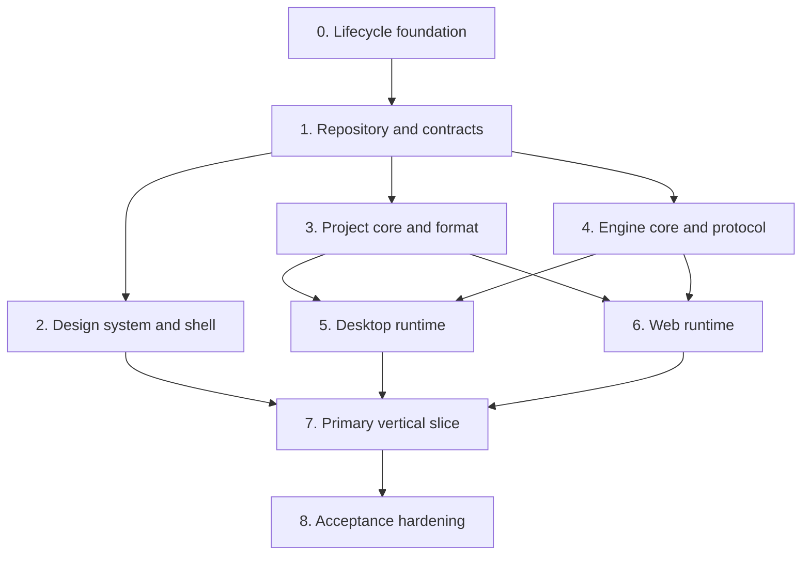

# Tiempio application skeleton — implementation plan

## Status and ownership

**Status:** implementation is complete through Stage 5 and the accepted pre-Stage-6 product work.
Retained Desktop hardware/packaged observations remain documented; Stage 6 planning is complete,
but Stage 6 implementation and Stages 7-8 have not started.

**Original planned integration branch:** `feature/application-skeleton`.

The original integration branch remains at the approved planning baseline. In the local repository,
the reviewed Stage 0-4 task branches were integrated by sequential fast-forwards into `main`, ending
at Stage 4 revision `d835cf9`. That history is retained rather than rewritten. The corrective
architecture alignment before Stage 5 was completed through
`docs/project-plan/ARCHITECTURE-ALIGNMENT.md` on branch `fix/architecture-alignment`; it does not
implement or claim any Stage 5 runtime behavior.

The detailed Stage 5 delivery plan is recorded in
`docs/project-plan/STAGE-5-DESKTOP-RUNTIME.md`. It treats the prototype-exact UI restored at
`9ee5191` as an immutable implementation baseline: Desktop runtime work may activate existing
truthful states, but it may not redesign or visually drift from the approved prototype.

The detailed Stage 6 delivery plan is recorded in
`docs/project-plan/STAGE-6-WEB-RUNTIME.md`. It preserves the same authority and visual boundaries,
adds an activation-gated WASM AudioWorklet plus browser persistence, and reflects the current
composite synth/drum engine rather than creating a Bass-only Web fork.

| Stage | Current state |
| --- | --- |
| 0 - Lifecycle foundation | Complete |
| 1 - Repository and contracts | Complete |
| 2 - Design system and shared shell | Complete; retained evidence exists |
| 3 - Project core and logical format | Complete; retained evidence exists |
| 4 - Engine core and offline proof | Complete; retained evidence exists |
| 5 - Desktop runtime | Implemented; automated acceptance complete, manual Windows hardware and packaged-GUI gates retained |
| 6 - Web runtime | Planning complete; implementation not started |
| 7 - Primary audible vertical slice | Not started |
| 8 - Acceptance hardening | Not started |

**Architecture authority:** `docs/architecture/TIEMPIO_ARCHITECTURE.md`.

This plan owns the construction of the first real Desktop/Web application skeleton and the
smallest audible end-to-end product slice. It is intentionally narrower than the complete product
concept. Completing this plan proves the architecture and leaves a safe foundation for subsequent
feature phases; it does not claim that Tiempio is already a complete music studio.

## Intended user-visible outcome

At completion, a user can launch Tiempio Desktop or Tiempio Web and follow one honest path:

> New track -> Bass -> Deep -> play from the computer keyboard -> hear the instrument -> place a
> short phrase -> play and stop it -> save or retain the project through the target's real
> persistence capability.

The complete seven-state prototype is represented by the real shared application shell:

1. Home;
2. first musical layer;
3. sound chooser;
4. piano roll;
5. drum sequencer foundation;
6. arrangement foundation;
7. sound-sculpt foundation.

Only the primary Bass vertical slice must be musically complete during this plan. The drum,
arrangement and sound-sculpt surfaces must be architecture-real and project-state-driven, but
their full production behavior belongs to later feature plans.

## Definition of the skeleton boundary

The skeleton includes:

- secure Electron and independent static Web production targets;
- shared React application and Tiempio design system;
- versioned application/runtime and engine contracts;
- canonical revisioned `ProjectSession`;
- minimal `.tiempio` project format and recovery contract;
- Rust DSP core with one curated Bass patch;
- native Desktop engine host;
- WebAssembly `AudioWorklet` engine adapter;
- real computer-keyboard audition;
- engine-owned transport for one short MIDI phrase;
- structured audio diagnostics;
- source, unit, boundary, smoke, visual/accessibility and audio acceptance gates;
- repository-owned bounded lifecycle workflows.

The skeleton excludes:

- production-quality complete synth and drum catalogs;
- large user-audio import and time stretching;
- complete MIDI-device recording UX;
- advanced synth controls, effects, automation and user routing;
- mixing and mastering workflows;
- immutable history and automatic disk autosave;
- full reference-track mode;
- stems and production export formats beyond a testable offline-render primitive;
- plugins, accounts, cloud sync, collaboration, AI generation and analytics;
- Linux release certification;
- repository-hosted automation under `.github/workflows/`.

Excluded scope must not be represented by fake enabled controls. A visible deferred action is
disabled with a clear reason or omitted according to the current context.

## Delivery method

This is a large task. Work proceeds only in the primary repository worktree.

1. `feature/application-skeleton` was the originally approved integration branch. The implemented
   Stage 0-4 history instead reached local `main` through reviewed task-branch fast-forwards. No
   historical branch pointer is moved to conceal that difference.
2. Every remaining implementation stage uses a separate branch created from an explicit current
   task integration head. Work never starts directly on `main`.
3. A stage branch contains only that stage's scope and atomic English commits.
4. The stage is reviewed and verified before it is merged into the integration branch.
5. Immediately after every commit, the lifecycle lock, cleanup quarantine and exact task-owned
   process identities are audited before any new check, branch, stage, commit or merge.
6. Resource-intensive dependency, Rust build, production build, package and audio acceptance
   commands run sequentially through the lifecycle owner. The user is warned before they start.
7. No work is merged into `main`, pushed or submitted as a pull request without explicit user
   authorization.

Planned stage branches:

```text
feature/skeleton-lifecycle-foundation
feature/skeleton-repository-contracts
feature/skeleton-design-shell
feature/skeleton-project-core
feature/skeleton-engine-core
feature/skeleton-desktop-runtime
feature/skeleton-web-runtime
feature/skeleton-primary-vertical-slice
feature/skeleton-acceptance-hardening
```

If a stage reveals a required architectural change, the integration plan and architecture
document are updated before implementation continues. Scope is not silently redistributed between
branches.

## Dependency sequence



Stages remain sequential in delivery even where the dependency graph would permit parallel coding.
This keeps resource ownership observable and prevents two heavy Node/Rust workflows from running
at once.

## Stage 0 — Lifecycle and repository safety foundation

**Branch:** `feature/skeleton-lifecycle-foundation`.

### Outcome

Every dependency installation, validation, test, build, code-generation and packaging entry point
has one fail-fast lifecycle owner before any of those workflows is introduced or run.

### Work

- Port the proven Yinkie lifecycle mechanism as an isolated engineering mechanism, renaming all
  product-specific identifiers to Tiempio.
- Add a minimal dependency-free root `package.json` and npm lockfile solely to expose and pin the
  Stage 0 lifecycle entry points. Application dependencies remain Stage 1 scope.
- Define one closed workflow catalog with direct executable and argument vectors.
- Launch children with `shell: false`.
- Add a repository-wide single-run lock containing owner PID, creation identity, workflow token,
  active stage and observed descendants.
- Add per-stage timeouts, progress heartbeats and a bounded whole-workflow deadline for composite
  gates.
- Forward SIGINT/SIGTERM/Windows interruption into the same exact-tree cleanup path used by failure
  and timeout.
- Prove ownership using PID, creation time, executable, command line, parent chain and task token;
  never kill by executable name.
- Preserve the lock and write a cleanup-required quarantine when process identity or cleanup cannot
  be proven.
- Add a read-only post-commit audit over the last-run journal, lock and quarantine.
- Reject direct `npm install`/`npm ci` lifecycle hooks and expose owned install workflows.
- Add Cargo commands to the same lifecycle catalog; Cargo is not permitted to become an opaque
  second lifecycle owner.
- Keep only documented interactive development processes as explicit long-lived exclusions.

### Verification

- Deterministic fake-process tests cover success, failure, timeout, interruption, duplicate lock,
  stale lock, PID reuse, foreign descendants, orphan after successful stage and cleanup failure.
- Static policy proves that every bounded process-creating script reaches the owner.
- A deliberately failed harmless fixture proves lock cleanup and no surviving task-owned process.
- `lifecycle:audit` passes after the stage commit.

### Exit criteria

- No dependency or build command is needed to test the initial Node-built-in lifecycle core.
- All future heavy workflow names are reserved in the closed catalog.
- The lifecycle owner can safely run Node and Cargo stages sequentially.
- No lock, quarantine or task-owned descendant remains after every fixture path.

## Stage 1 — Repository topology and versioned contracts

**Branch:** `feature/skeleton-repository-contracts`.

### Outcome

The repository contains two empty production composition roots and shared public contracts with
enforced dependency direction.

### Work

- Expand the pinned root `package.json` and npm lockfile with application dependencies, then add
  TypeScript project configs plus ESLint and Prettier configuration.
- Add the root Rust workspace, pinned toolchain declaration and Cargo lockfile.
- Create `apps/desktop`, `apps/web`, shared `packages` and `engine/crates` topology from the
  architecture document.
- Add Electron Vite and independent Web Vite configurations with separate output directories.
- Define `ApplicationRuntime` capability groups for projects, resources, engine/audio, settings,
  commands, lifecycle and optional platform integration.
- Define neutral application error codes and discriminated persistence outcomes.
- Define `engineProtocolVersion`, handshake, bounded command/event envelopes and stable diagnostic
  codes in one schema authority consumed by TypeScript and Rust.
- Add generated-code policy if protocol bindings are generated. Generated files must be
  deterministic and updated only through the lifecycle owner.
- Add static target-boundary rules:
  - shared code cannot import Desktop or Web;
  - Web cannot import Electron, Node filesystem or Desktop transport;
  - Desktop renderer cannot import Electron directly;
  - engine crates cannot depend on application/UI packages.
- Add strict production CSP markers for Desktop and Web.
- Establish initial bundle classes and empty-shell size budgets before feature growth.

### Edge cases

- Runtime or engine protocol version mismatch fails before application/session creation.
- An unavailable capability has a typed result; it is not represented by a throwing placeholder
  hidden behind target checks.
- Web build output cannot enter Desktop `app.asar`.
- Native engine artifacts cannot be loaded from a development-relative path in a package.

### Verification

- Node and Web type checks.
- Rust workspace check.
- Target import-policy tests.
- Production Desktop and Web empty builds.
- Package-content policy fixture proving target artifact separation.
- Bundle attribution and initial budget report.

### Exit criteria

- Both targets build independently from one shared revision.
- Shared contracts expose no Electron, DOM file handle, child-process or native path type.
- Version mismatch and unavailable-capability contract tests pass.
- The worktree and lifecycle audit are clean after the stage merge.

## Stage 2 — Tiempio design system and shared application shell

**Branch:** `feature/skeleton-design-shell`.

### Outcome

Desktop and Web mount the same accessible React shell and represent all seven prototype states
without embedding a second static prototype implementation.

### Work

- Add shared `mountApplication(runtime)` composition.
- Add application runtime, settings, localization and command providers.
- Create the Tiempio semantic theme token registry with the approved family in System, Light and
  Dark modes.
- Convert prototype geometry to semantic relative tokens and container-based layout.
- Implement shared application-owned:
  - icon and text buttons;
  - tooltip;
  - popover;
  - select/dropdown;
  - semantic slider;
  - scroll surface and global scrollbar treatment;
  - focus ring and reduced-motion behavior;
  - Windows custom title controls and macOS integrated-title spacing.
- Build the stable shell: title area, activity rail, project top bar, layer list, central workspace,
  right contextual area and compact fallback drawer.
- Implement typed presentation states for Home, First Layer, Sound Chooser, Piano Roll, Drums,
  Arrangement and Sound Sculpt.
- Use feature view models rather than hard-coded demo HTML so Stage 3 can attach real project data
  without rewriting components.
- Add EN, RU and ES typed catalogs. Musical content and project names are never localized.
- Add one command registry used by controls, DOM shortcuts and future native menus.

### Edge cases

- Compact width and constrained height retain access to context that the prototype visually hides.
- All visible scrollable surfaces use the same scrollbar states.
- Every dropdown has themed trigger, panel, option, selected, hover, focus and disabled treatment.
- Mute, solo, selected track, scale and diagnostics have non-color signals.
- Browser-reserved shortcuts have visible alternatives.
- Tooltips never become the only accessible name.

### Verification

- Component/model tests for command presentation, popover lifecycle and responsive state changes.
- Static theme-token and localization parity policies.
- Light/Dark screenshots at compact, standard and ultrawide viewports.
- Constrained-height overflow assertions.
- Keyboard traversal, focus restoration and reduced-motion checks.
- Desktop custom-title controls and macOS title-spacing unit tests.

### Exit criteria

- One shared shell renders in both targets.
- All seven prototype states are reachable through typed application navigation.
- No target-specific branch exists inside feature components.
- Equivalent controls share one design-system implementation.
- No prototype-only fixed geometry has become a production responsive dependency.

## Stage 3 — Project model, session and minimal format

**Branch:** `feature/skeleton-project-core`.

### Outcome

All prototype surfaces read one validated project snapshot, and project mutations advance one
canonical revision with deterministic persistence round trips.

### Work

- Define versioned project schema with stable IDs and integer PPQ time.
- Implement layers, MIDI clips, minimal drum clips, sections, transport, key and instrument source.
- Define resolved Bass patch, semantic macros, preset revision and patch-model version.
- Implement pure validators and migrations.
- Implement `ProjectSession` snapshots with revision, persisted revision, dirty state and typed
  command application.
- Add bounded in-memory undo/redo for semantic commands.
- Implement initial commands:
  - create project;
  - add musical-role layer;
  - select preset/character;
  - update and commit semantic macro;
  - add/move/resize/delete note;
  - transpose octave;
  - set layer mute, solo and gain;
  - set tempo, key and loop;
  - create minimal section and clip placement.
- Keep presentation selection, zoom, scroll and open panels outside project revision.
- Implement logical `.tiempio` archive model and manifest codec.
- Add one checksummed recovery-snapshot contract independent of explicit Save.
- Implement render-plan compilation as a pure revision-bound function.

### Edge cases

- Duplicate/missing IDs, invalid references and cycles fail validation.
- Negative/out-of-range ticks, zero durations and integer overflow fail closed.
- Unknown future schema and patch versions preserve original bytes and refuse destructive Save.
- Out-of-scale notes remain valid musical data.
- A mutation during Save leaves the newer revision dirty.
- Preset catalog changes do not change a resolved saved patch.
- Reference layers are excluded from export plans by data, not by UI convention.

### Verification

- Schema and migration fixtures.
- Repeated serialize/parse/serialize round trips.
- Property-based or exhaustive bounded command-sequence tests where practical.
- Undo/redo invariants.
- Save-revision race tests.
- Render-plan determinism and stale-revision tests.
- Fuzz or corpus tests for malformed manifests and archive metadata without decoding unbounded data.

### Exit criteria

- The seven shared surfaces can project from one in-memory `ProjectSession`.
- A minimal project round-trips exactly or through one documented canonical normalization.
- Resolved Bass sound state survives catalog changes in fixtures.
- No project mutation exists only inside a React component.
- Recovery and Save acknowledgements are revision-bound and independently tested.

## Stage 4 — DSP core, protocol and deterministic offline proof

**Branch:** `feature/skeleton-engine-core`.

### Outcome

The platform-neutral Rust engine can compile and render the minimal Bass project deterministically
without Electron, Web APIs or a live audio device.

### Work

- Implement bounded protocol frame parsing and handshake types.
- Implement transport clock, tempo conversion and event scheduler.
- Implement preallocated voice pool and note lifecycle.
- Implement one subtractive-synthesis Bass voice and one reviewed `Deep` patch.
- Implement master gain and safe limiter/clip policy sufficient for the slice.
- Implement parameter smoothing and block-boundary render-plan swap.
- Implement ephemeral note-on/note-off audition.
- Implement a deterministic offline block renderer used by tests.
- Expose engine capabilities, revision acknowledgement and audio health diagnostics.
- Add real-time invariant documentation beside the callback boundary.
- Establish explicit ceilings for voices, scheduled events, plan bytes and protocol frames.

### Edge cases

- Note-off for unknown/already-ended voice is harmless and bounded.
- Voice exhaustion applies a documented deterministic voice-stealing policy.
- NaN/infinite/out-of-range patch values fail validation before the callback.
- Tempo, seek or plan changes cannot leave stuck notes.
- Stale plans and deltas are rejected or ignored without replacing a newer active revision.
- Protocol corruption terminates the session safely without undefined audio output.
- Offline rendering is deterministic within the documented floating-point tolerance.

### Verification

- Rust unit tests for oscillators, envelopes, scheduling, voice stealing and smoothing.
- Golden offline waveform/spectrum fixtures with reviewed numeric tolerance.
- Silence/DC/clipping/NaN tests.
- Protocol malformed-frame, oversized-frame and version-mismatch tests.
- Allocation-detection or callback harness proving no allocation in steady-state render.
- Deadline benchmark fixture recorded as a baseline, not used as a flaky unit assertion.

### Exit criteria

- A minimal render plan produces an audible deterministic Bass phrase offline.
- The DSP core has no Electron, Node, Web or filesystem dependency.
- The steady-state render path satisfies the documented real-time invariants.
- Protocol and project revisions are bound in acknowledgements.
- Engine limits fail with structured diagnostics instead of unbounded resource growth.

## Stage 5 — Secure Desktop runtime and native engine host

**Branch:** `feature/skeleton-desktop-runtime`.

### Outcome

The packaged Electron application supervises the native engine, plays the real Bass instrument in
Shared Audio mode and durably opens/saves a minimal project through opaque project handles.

### Work

- Implement secure Electron main, preload and renderer composition root.
- Add single-instance lifecycle and one current-window foundation.
- Implement project registry, native dialogs, canonical paths and opaque handles.
- Implement bounded archive read, fingerprint, atomic Save/Save As and recovery store.
- Implement native engine-host binary entry and shared backend initialization.
- Implement `EngineHostSupervisor` with direct child launch, unpredictable token, handshake timeout,
  heartbeat, exact identity, graceful termination and bounded exact-tree cleanup.
- Add length-prefixed bounded transport between Electron main and engine host.
- Adapt native engine capabilities into `DesktopRuntime`; renderer never sees the process transport.
- Route computer-keyboard audition, transport and project render plans through the typed bridge.
- Implement structured audio health and device-change events.
- Package the engine binary in an explicit architecture-specific location and exclude source/build
  material from `app.asar`.

### Edge cases

- Engine binary missing, incompatible, corrupt or unable to start.
- Handshake timeout or protocol mismatch.
- Engine exits during playback or while applying a plan.
- Default audio device disappears or changes.
- Shared backend cannot open while another application is playing.
- Renderer reloads without orphaning an engine.
- Application close races a recovery write or engine shutdown.
- Project changed externally, missing, read-only or colliding on Save As.
- ZIP traversal, decompression bomb, excessive entries or oversized manifest.

### Verification

- Main/preload/renderer contract tests with no raw IPC leakage.
- Engine supervisor fake-process tests for every lifecycle path.
- Native host integration test with a controlled/null backend where available.
- Real packaged Windows Shared Audio smoke while a second audio source remains active.
- Device-loss/reopen test on supported test hardware or a documented host fixture.
- Project open/save/restart/recovery and fingerprint-conflict smoke.
- Packaged-content and Electron security/fuse policies.
- Exact post-run lifecycle audit.

### Exit criteria

- The packaged Desktop application plays the real Rust Bass engine.
- Engine failure leaves the current project revision and recovery intact and offers restart.
- Renderer has no native path or raw engine process authority.
- Minimal `.tiempio` Save is atomic and fingerprint-guarded.
- Shared Audio coexistence is demonstrated on the Windows acceptance host.

## Stage 6 — Static Web runtime and WASM AudioWorklet

**Branch:** `feature/skeleton-web-runtime`.

### Outcome

The independent static Web target plays the same Bass patch through the same DSP core and retains a
minimal project without claiming native guarantees.

The current accepted engine baseline now includes five synth families and procedural drums. `Deep`
remains the minimum Stage 6 proof, but the Web adapter must expose the shared composite engine rather
than a target-specific Bass-only subset; the detailed parity scope is defined in
`STAGE-6-WEB-RUNTIME.md`.

### Work

- Compile the shared DSP core to a WebAssembly module for an `AudioWorklet`.
- Implement the bounded worklet message adapter and revision acknowledgements.
- Start/unlock audio only during a valid user activation.
- Implement `WebRuntime` capabilities and neutral error mapping.
- Open `.tiempio` file snapshots and writable handles through feature-detected browser APIs.
- Implement direct write only with current permission.
- Implement Download copy as a distinct non-persisted outcome.
- Add versioned IndexedDB settings and checksummed bounded recovery.
- Add storage-degradation and permission-revocation diagnostics.
- Ensure the production Web artifact is static, content-hashed, source-map-free and governed by a
  strict CSP.
- Keep worklet/WASM assets out of the initial shell graph until the user starts an audio path.

### Edge cases

- Browser denies or suspends `AudioContext`.
- Autoplay policy changes between load and interaction.
- AudioWorklet or WASM initialization fails.
- Browser file handle permission is revoked after open.
- IndexedDB is unavailable, full or corrupt.
- Download is requested but completion cannot be observed.
- Page visibility changes or output device changes during playback.
- Web memory ceiling is lower than the project or render plan requires.
- Browser-reserved keyboard shortcuts conflict with application commands.

### Verification

- Shared engine-protocol scenarios run against Desktop and Web adapter fakes.
- Browser tests cover user activation, suspended audio, worklet load, note audition and transport.
- Persistence tests cover snapshot open, writable handle, revoked permission, Download and recovery.
- Network inspection proves no project content, name or path is transmitted.
- Production CSP and bundle graph checks.
- Representative latest-stable browser matrix is recorded before public distribution; the
  skeleton may initially gate to the locally supported browser set.

### Exit criteria

- Web plays the same reviewed `Deep` patch through WASM in an `AudioWorklet`.
- Suspended or unavailable browser audio produces one actionable diagnostic.
- Download does not clear dirty or recovery state.
- Shared/Web bundles contain no Electron or native filesystem code.
- Web remains usable for an in-memory project when persistent browser storage is unavailable.

## Stage 7 — Primary audible vertical slice

**Branch:** `feature/skeleton-primary-vertical-slice`.

### Outcome

The real project model, shared UI, target persistence and both engine adapters are connected into
the first-hour path's smallest complete proof.

### Work

- Wire Home -> New Track -> Bass -> Deep to real `ProjectSession` commands.
- Resolve the `Deep` preset into a versioned DSP patch.
- Implement computer-keyboard mapping and visible note feedback.
- Send audition note-on/off directly to the engine while keeping committed project content in
  `ProjectSession`.
- Implement minimal piano-roll note creation, selection and octave shift.
- Implement engine-owned play/stop/seek and one bounded loop.
- Compile and apply revision-bound render plans after project commits.
- Interpolate throttled engine transport snapshots in the UI.
- Implement preview/commit semantics for the prototype's sound-character controls.
- Wire layer mute and gain into project commands and diagnostics.
- Implement save/recovery presentation according to target capabilities.
- Replace all remaining demo view models with projections of real startup/project/engine state.
- Keep Drums, Arrangement and Sound Sculpt foundations honest: real project data and commands where
  present, clearly unavailable future operations otherwise.

### Edge cases

- Key-up is missed because focus/window visibility changes; all ephemeral notes must be released.
- React Strict Mode mount/unmount must not duplicate engine clients or notes.
- Rapid macro preview followed by cancel or commit cannot leave the engine on stale parameters.
- A project edit while an older render plan is compiling cannot activate the stale plan.
- Mute/gain changes during held notes are smoothed and reflected in diagnostics.
- Play after engine restart reloads the latest project revision before sounding.
- Switching project/surface releases editor leases and live notes.
- Web user activation happens only once and does not create duplicate `AudioContext` instances.

### Verification

- End-to-end state test of the complete primary path in Desktop and Web.
- Source-level command coverage proves each visible enabled control has one real handler.
- Packaged Desktop and production Web smoke with actual engine output.
- Audio capture or deterministic host evidence proves non-silent output after the first key.
- Stale render-plan and rapid-preview integration tests.
- Keyboard focus, stuck-note and visibility-change tests.
- Minimal save/reopen/recovery continuation of the created phrase.

### Exit criteria

- The primary user path produces real audio without a tutorial or manual routing.
- Desktop and Web use the same project commands, preset and DSP implementation.
- No enabled control in the slice is a visual-only mock.
- A missing output, suspended Web context, muted layer or absent instrument has a specific recovery
  action.
- The saved/recovered phrase reopens with the same notes and resolved patch.

## Stage 8 — Acceptance hardening and evidence

**Branch:** `feature/skeleton-acceptance-hardening`.

### Outcome

The combined integration branch is audited against the architecture and has reproducible evidence
for safety, target separation, UX, audio and lifecycle behavior.

### Work

- Review the complete diff against this plan, the architecture and product invariants.
- Remove obsolete scaffolding, demo state and accidental abstractions.
- Add combined release catalog and independent Desktop/Web artifact policies.
- Finalize initial bundle, memory, render-plan, latency and callback deadline budgets from measured
  results.
- Add packaged Windows evidence for Shared Audio, primary path, save/recovery and engine restart.
- Add Web production evidence for local-only behavior, audio activation and persistence fallbacks.
- Add light/dark and compact/standard/ultrawide visual baselines plus constrained-height scenarios.
- Complete keyboard and accessibility walkthrough.
- Document supported operating systems, browser assumptions and residual risks.
- Update architecture and this plan where implementation evidence changed an approved detail.
- Add a machine-readable acceptance manifest mapping every skeleton exit criterion to tests or
  retained evidence.

### Combined validation strategy

The lifecycle owner runs stages sequentially and stops at the first failure:

1. dependency reproducibility and security;
2. formatting and lint;
3. generated protocol/schema consistency;
4. TypeScript tests and type checks;
5. Rust format, lint and tests;
6. target/import/security policy tests;
7. Desktop production build;
8. Web production build;
9. bundle budgets and topology;
10. native engine build and protocol smoke;
11. unpacked Desktop packaging;
12. packaged Desktop primary-path/audio/durability scenarios;
13. production Web browser scenarios;
14. visual/accessibility matrix;
15. packaged-content and final lifecycle audit.

Each stage has a measured timeout and heartbeat. The overall release workflow has a separate
bounded deadline that forwards through the same cleanup path. No opaque `&&` chain or recursive npm
script owns the workflow.

### Exit criteria

- Every foundational criterion in `TIEMPIO_ARCHITECTURE.md` has executable or retained evidence.
- All checks pass from a clean integration branch under one lifecycle owner.
- No task-owned process, lock or cleanup quarantine remains.
- Desktop and Web production artifacts are independently inspectable and target-clean.
- The final diff contains no unrelated or pre-existing changes.
- Documentation describes actual behavior and remaining limits without presenting future scope as
  implemented.

## Cross-stage edge-case inventory

These cases must remain visible in stage reviews even when their final handling belongs later.

### Data and durability

- invalid, corrupt, truncated or future-version project;
- project larger than bounded manifest/archive limits;
- interrupted Save before and after atomic replace;
- edit while Save or recovery write is in flight;
- external modification, deletion and read-only destination;
- duplicate canonical paths and second-instance open request;
- recovery newer than the saved project;
- browser Download requested but not observable as completed;
- revoked browser file-handle permission;
- unavailable or corrupt browser storage.

### Audio and timing

- missing, busy or changed output device;
- Shared Audio backend cannot open;
- Web audio suspended by autoplay policy;
- engine startup timeout, crash or protocol mismatch;
- audio callback deadline miss and underrun;
- invalid patch value or render-plan overflow;
- stuck note after key-up loss, blur, visibility change or engine restart;
- plan, seek, tempo or loop change while voices are active;
- voice exhaustion;
- sample-rate or buffer-size negotiation change;
- stale plan/preview/diagnostic event.

### UI and accessibility

- compact width, ultrawide width and constrained height;
- 100%, 125% and 150% representative device-pixel ratios;
- Light, Dark and live System scheme changes;
- keyboard-only command path;
- focus return after popover/dialog dismissal;
- tooltip collision and viewport-bounded dropdown overflow;
- complete global scrollbar treatment;
- reduced motion and high contrast;
- non-color state signals;
- localization expansion and untranslated dynamic content.

### Security and privacy

- malformed IPC and engine protocol sender/payload;
- archive path traversal and decompression bomb;
- oversized audio decode or render plan;
- arbitrary navigation/new-window request;
- accidental Desktop/Web artifact contamination;
- accidental project content/path/name in logs, metrics or network activity;
- untrusted generated protocol artifact or mismatched schema hash.

## Regression strategy

Every stage review asks:

1. Does the change preserve the one-project-authority rule?
2. Does it keep the audio clock out of React?
3. Does it add a target-specific branch to shared product code?
4. Does it weaken native durability to match Web limitations?
5. Can a stale asynchronous result replace newer project or engine state?
6. Can user content be lost, overwritten, disclosed or made unrecoverable?
7. Does a new control bypass the shared dropdown, scrollbar, focus or theme treatment?
8. Does a heavy dependency enter the initial shell or wrong target graph?
9. Does a native or Rust process escape lifecycle ownership?
10. Is an abstraction justified by present skeleton scope rather than a speculative future feature?

Shared changes validate both target graphs. Desktop adapter changes validate Desktop plus shared
contract scenarios. Web adapter changes validate Web plus shared contract scenarios. DSP changes
validate native and WASM compilation plus deterministic offline fixtures.

## Overall definition of done

The application skeleton is complete only when all of the following are true:

### Product

- A new user can create a project, choose Bass/Deep, press a computer key and immediately hear a
  real synthesized sound in Desktop and Web.
- The user can place a short phrase, play/stop it and transpose a selected note or phrase by an
  octave.
- The seven prototype states belong to one coherent shared application and one project session.
- Shared Audio is the Desktop default and Web audio limitations are explicit.
- No silent failure exists for the supported primary path.

### Architecture

- One TypeScript project model serves both targets.
- One Rust DSP core serves native and WASM hosts.
- Desktop audio runs outside renderer; Web audio runs in `AudioWorklet`.
- Project state, engine state and settings authority are explicit and non-overlapping.
- Desktop and Web differ through versioned capabilities, not duplicated feature implementations.
- Renderer has no Node, filesystem path or engine process authority.

### Durability

- A minimal `.tiempio` project round-trips without data loss.
- Desktop Save is fingerprint-guarded and atomic.
- Web Download does not falsely acknowledge Save.
- Recovery is checksummed, bounded and independent of explicit Save.
- Engine failure cannot erase the latest project revision or recovery snapshot.

### UI quality

- The prototype's editorial neutral/coral visual language is implemented through semantic tokens.
- Light, Dark, compact, standard, ultrawide and constrained-height states are complete.
- Dropdowns, scrollbars, focus, hover, active, selected and disabled states use shared treatments.
- Keyboard navigation and assistive-technology labels cover every supported action.
- State is never encoded only through color.

### Audio quality and performance

- The steady-state callback obeys no-allocation/no-blocking rules.
- Engine limits and overloads produce structured diagnostics.
- First-audible-result, callback deadline, underrun, memory and bundle baselines are measured and
  documented.
- Stale render plans and preview updates cannot become active.
- The `Deep` patch produces the same approved result across native and WASM within documented
  numeric tolerance.

### Engineering process

- All bounded workflows use the fail-fast lifecycle owner.
- Resource-intensive workflows run sequentially with timeouts and heartbeats.
- Success, failure, timeout and interruption leave no owned process or lock.
- Every stage is integrated through an atomic reviewed branch and commit history.
- The final integration branch is clean and ready for review, but is not merged into `main`, pushed
  or submitted as a pull request without explicit authorization.

## Next plan after skeleton

The next product plan should be written only after skeleton evidence exists. Its likely focus is the
complete first-hour composition loop: production drum synthesis and patterns, mature piano-roll
editing, arrangement operations, layer gain/mute/solo, sound sculpt, save/reopen and initial WAV
export. Exact scope and sequencing must be based on measured engine, UX and bundle results from this
foundation.
