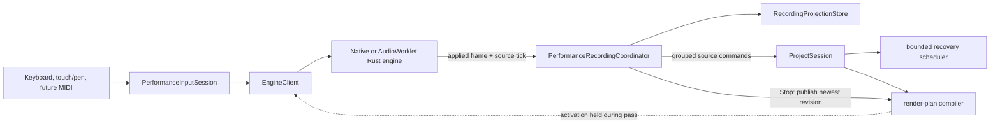

# Stage 9B — linear performance recording into a brick

## Status and authority

**Status:** implemented on `feature/brick-editor-performance`, 2026-08-15, from the user-approved
AS-TO-BE product direction dated 2026-08-13.

This stage runs after Stage 9A editor/navigation work and before Stage 10 linked-bricks composition.
It owns recording a played performance from the laptop keyboard or on-screen keyboard into the
selected source brick. It also establishes an input contract ready for a later MIDI-device adapter.

Before any recording branch begins, three mandatory entry gates run in order:

1. [`STAGE-7A-CONTEXTUAL-BRICK-CREATION.md`](STAGE-7A-CONTEXTUAL-BRICK-CREATION.md) keeps
   existing bricks visible/reachable and defers canonical layer creation until final sound/kit
   confirmation;
2. [`STAGE-7B-FOCUS-SAFE-AUDITION.md`](STAGE-7B-FOCUS-SAFE-AUDITION.md) corrects shared
   keyboard-intent routing and `SemanticSlider` commit semantics;
3. [`STAGE-8-PERCEPTUAL-SOUND-QUALITY.md`](STAGE-8-PERCEPTUAL-SOUND-QUALITY.md) freezes the
   researched, measured and blind-reviewed built-in catalog, patch model and semantic macro
   mappings before current sources begin persisting them.

Fine Tuning must never disable physical-key audition merely because a range retains focus;
recording then reuses that proven input boundary instead of introducing a second focus policy.

The Stage 8 engineering gate is satisfied by the user-approved merge at `76cef01`. Its deferred
human preference study remains honest follow-up evidence but does not block Stage 9 and is not
claimed as passed.

The recording decision is deliberately separate from sound selection:

- [Sound Chooser light](../evidence/prototype-visual-reference/light/03-sound-chooser.png) and
  [Sound Chooser dark](../evidence/prototype-visual-reference/dark/03-sound-chooser.png) remain
  audition-and-selection surfaces. Playing there never creates notes. Mapped physical keys remain
  available while a non-text control such as Fine Tuning owns focus.
- After `Use sound`, recording belongs to the source editor represented by the
  [Piano Roll light](../evidence/prototype-visual-reference/light/04-piano-roll.png) and
  [Piano Roll dark](../evidence/prototype-visual-reference/dark/04-piano-roll.png) references.
- The final placement of the source editor next to the collapsible song dock is represented by the
  approved [linked-bricks light](../evidence/song-composition-visual-reference/light/06-linked-bricks-song.png)
  and [linked-bricks dark](../evidence/song-composition-visual-reference/dark/06-linked-bricks-song.png)
  references.

Those references do not show the Record control or the source-editor performance-keyboard dock.
Their shared geometry and design language remained authoritative. The recording delta described
here was implemented in that geometry and verified in wide and constrained production Web layouts;
interactive packaged Desktop review remains an explicitly retained manual observation.

This plan supersedes the earlier deferral of played-performance recording in
[`STAGE-9A-NOTE-EDITOR-INTERACTIONS.md`](STAGE-9A-NOTE-EDITOR-INTERACTIONS.md). It does not add recording to Sound
Chooser and does not authorize complete MIDI-device discovery or configuration.

## Product decision

Recording is direct source editing, not a take-approval workflow:

1. the user finishes sound selection with `Use sound`;
2. in the brick editor, the user places the source playhead at any tick, including empty space to
   the right of the current material;
3. Record starts a one-bar count-in;
4. recording begins exactly at the chosen source tick, never at the first played note;
5. existing notes remain and sound; new notes are added as an overdub;
6. notes appear and grow visibly while they are played;
7. Stop ends capture but does not ask the user to accept or save the pass;
8. another recording can begin from any new playhead position;
9. one Undo removes the complete most recent recording pass.

There is no default Replace mode, no automatic deletion under the recording range and no automatic
quantization. Overlapping notes, repeated pitches and chords built across several passes are valid.

## Core terms

### Source playhead

The source playhead is a presentation position in the selected brick timeline. Moving it, scrolling
or zooming does not change the project. Play and Record use its exact tick; neither silently snaps it
unless the user explicitly invokes a snap command.

Its whole visible vertical line is one reachable control with a larger transparent pointer/touch
hit target. The user may grab it at any height and drag continuously left or right between grid
boundaries; pointer capture and edge auto-scroll preserve the gesture. An idle move never starts
Play, audition or Record. Stage 9B-5 exposes this manual semantic tick control without binding it to the
global song transport. Stage 10 binds the moving presentation to the selected brick's independent
engine preview cursor while that brick is actually sounding.

### Recording pass

A recording pass starts when the engine enters the `recording` state after count-in and ends at the
engine-acknowledged stop tick. It has a stable bounded recording ID, target layer ID, start tick,
recorded-through tick and input-note IDs.

The recording ID is transient coordination metadata. It is not saved inside each musical note.
Canonical notes retain stable note IDs, pitch, start tick, duration and velocity.

### Automatic commit and Undo group

The project does not wait for Stop to “fix” or accept the take:

- an engine-acknowledged note-on automatically creates the canonical note with the minimum valid
  duration;
- the live projection grows the held note with the engine recording cursor;
- engine-acknowledged note-off automatically commits its final duration;
- source-range extensions are applied at bounded checkpoints while recording advances;
- every command uses `historyGroup: recording:<recordingId>`;
- Stop closes held notes, records the final range and calls `endHistoryGroup` only.

Therefore Stop is a transport boundary, not a confirmation boundary. Existing
`ProjectSession` history grouping provides one Undo entry for all notes, duration finalizations and
material-length changes in the pass. Redo restores that complete pass. Undo is unavailable while
the engine is actively recording; the user stops first and then undoes.

Project state becomes dirty as recording commands apply. The existing explicit Save semantics do
not become automatic disk autosave, but recovery scheduling must observe the canonical revisions
created during a long pass.

## Open-ended source timeline

The source editor must not stop at a preset 4-, 8- or 16-bar width.

### Canvas behavior

- The horizontal grid is virtualized and grows in chunks as the viewport approaches its right edge.
- The user may scroll far beyond the current material end without changing the project revision.
- The current material end remains visible as a labelled boundary, not as a disabled wall.
- Clicking the ruler beyond that boundary moves only the source playhead.
- Adding, moving or recording a note beyond the boundary extends source material automatically.
- Dragging the material-end handle to the right creates intentional silent material even without a
  note.
- Dragging the boundary left cannot silently delete notes. The first implementation clamps at the
  last event; a later destructive trim requires an explicit consequence and confirmation.

The UI has no small artificial endpoint, but storage, render plans and viewport arithmetic remain
bounded. Stage 9 must define a versioned maximum material tick and note count from measured
Desktop/Web engine and memory budgets. Reaching the limit stops extension with one actionable
diagnostic; it never wraps, clips events silently or freezes the UI.

### Recording across the old end

Recording is always linear:

- it never loops back to source tick zero;
- crossing the old end extends the material and auto-scrolls the viewport;
- the recorded range extends through silence as well as played notes;
- starting at a playhead beyond the old end preserves the whole intervening silence;
- stopping after a long silent interval preserves that interval as part of the brick;
- `newMaterialEnd = max(previousMaterialEnd, recordingStopTick, everyRecordedNoteEnd)`.

A pass containing only silence may therefore extend material. That is a deliberate result of
starting and stopping Record; one Undo restores the previous boundary.

Scrolling alone never extends material. This distinction prevents an accidental touchpad gesture
from changing the music while still allowing an arbitrarily placed later phrase.

### Two-axis viewport hand-off

The recording editor must not assume that every authored pitch is vertically visible. Its canvas
contract exposes independent semantic time and pitch anchors plus horizontal and vertical zoom.
Those values remain presentation-only and can be retained outside the mounted editor component.

The Stage 9 navigation branch establishes the reusable two-axis viewport store, keys snapshots by
stable source layer, restores each brick independently and adds synchronized rulers plus the
reviewed top/bottom indicators for canonical notes outside the visible pitch band. Stage 10C reuses
that authority when linked instances select the same source. The complete brick-switching and
edge-ghost contract is authoritative in
[`STAGE-10-LINKED-BRICKS-AND-SONG.md`](STAGE-10-LINKED-BRICKS-AND-SONG.md#two-dimensional-source-canvas-and-per-brick-viewport-memory).

Recording time never depends on the viewport. A live or canonical note outside the visible pitch
range may update a directional edge indicator, but the editor does not jerk vertically after every
played note. An explicit follow/show action may reveal the played range.

### Material silence and explicit loop pause

Silent time inside `materialLengthTicks` is ordinary source material and may occur between any two
notes. `tailRestTicks` remains a separately visible rest appended after material and repeated at the
end of every loop.

If recording enters an existing tail rest:

1. material length grows through the recorded range;
2. the occupied prefix is removed from `tailRestTicks` so the original cycle end is preserved while
   possible;
3. any recording beyond the old cycle grows material further and leaves `tailRestTicks` at zero;
4. no note may remain inside a region still labelled as trailing rest.

This keeps source time continuous and prevents the UI from claiming that audible notes are a pause.

## Recording state machine

```text
idle
  -> count-in             Record / KeyR
count-in
  -> idle                 Escape, audio failure or explicit cancel; no project mutation
  -> recording            engine reaches exact target tick
recording
  -> stopping             Record, Space, Escape, layer/project switch, blur or device failure
stopping
  -> idle                 engine closes held notes and acknowledges final tick
  -> recovery-required    engine cannot acknowledge; close at last trusted engine tick
```

Only one recording session may exist per application engine client. Duplicate starts, stale events
and events carrying another recording ID are rejected or ignored deterministically.

### Count-in

- The first UI ships with one bar of count-in by default.
- Its duration is derived from the project meter at the target tick, not hard-coded to four beats.
- In `4/4`, the overlay may show `4 · 3 · 2 · 1`; in `3/4`, `3 · 2 · 1`.
- Count-in never shifts, snaps or rewrites the selected start tick.
- Where prior source time exists, the preceding bar plays as pre-roll with the metronome.
- Near source tick zero, unavailable negative source time is replaced by metronome-only count-in.
- Keys played during count-in remain audible monitoring but are not recorded before the boundary.
- A key held across the boundary creates a recorded note starting exactly at the target tick.
- Escape during count-in returns to idle with no mutation.

The engine protocol keeps count-in length explicit even if the first UI exposes only one bar, so a
later reviewed `Off / 1 bar / 2 bars` preference does not require another protocol redesign.

## Monitoring and playback authority

Record is visually and behaviorally different from upper brick preview and lower song playback.

Starting Record:

- stops lower song transport and any ordinary brick-preview session;
- freezes a monitor snapshot of the latest acknowledged project revision;
- plays the selected source's existing material through count-in and recording;
- includes other speaker-enabled bricks as backing material;
- phase-aligns initially enabled backing bricks to the record cursor modulo each source cycle;
- captures input only into the selected source layer.

A backing brick enabled after recording has started follows the approved live-preview rule and
starts at its own source zero. Disabling it releases only that monitor source. Speaker changes remain
transient and never enter the recorded material or persistent song mute state.

Canonical notes created during the pass are rendered as live input only and are not inserted into
the frozen monitor snapshot. This prevents a newly recorded note from sounding once as input and a
second time after a mid-pass render-plan publication. The render-plan publisher holds ordinary plan
activation while recording and publishes only the newest project revision after Stop.

The selected source does not loop while recording. Backing sources may loop by their own cycles for
monitoring, but their loop phase never changes the target source tick assigned to captured notes.

## Input and timing contract

### One normalized performance event

Keyboard, pointer and future MIDI adapters produce the same bounded application event:

```text
PerformanceInputEvent
  sourceId                  # physical key, pointerId or MIDI note/channel identity
  sourceKind                # keyboard | pointer | midi
  phase                     # note-on | note-off
  pitch                     # MIDI 0...127
  velocity                  # MIDI 1...127 on note-on
  sourceTimestamp?          # trusted only for an adapter with a defined clock mapping
```

Capture must retain source identity, not pair notes by pitch. Two fingers, two MIDI messages or a
keyboard key and pointer may hold the same pitch simultaneously and must create separate notes.

### Engine-clock authority

DOM event time, `Date.now()` and React render time are not canonical musical timing. The engine:

1. receives the input command with recording ID and audition ID;
2. applies note-on/off at an actual audio sample frame;
3. maps that frame through the recording anchor and tempo map to integer source ticks;
4. emits a bounded acknowledgement containing recording ID, audition ID, phase, sample position and
   source tick;
5. provides the exact stop tick used to close held notes.

Tick conversion uses the project PPQ and deterministic rounding to the nearest representable tick.
It is not grid quantization. Duration is at least one tick. A separately invoked future `Quantize`
command may transform canonical notes, but recording never does so automatically.

Computer/touch input is recorded at the frame where the user hears the engine apply it. A future
MIDI adapter may compensate a device timestamp only after negotiating a stable mapping to the same
engine clock.

### Velocity and pressure

Every recorded note stores velocity immediately; the model does not wait for MIDI support.

- A laptop physical key uses the configured/default velocity because normal key events do not
  report strike force.
- A mouse uses that same fallback. The synthetic pressed value commonly exposed for a mouse is not
  presented as pressure sensitivity.
- `pointerType: touch` or `pen` maps a finite nonzero `PointerEvent.pressure` at pointer-down through
  one shared clamped curve into MIDI velocity 1-127.
- Hardware that reports a constant pressure such as `0.5` still produces an honest constant
  velocity; Tiempio does not fabricate variation.
- Pressure changes after note-on are reserved for a future aftertouch/expression contract. They do
  not rewrite note-on velocity in this stage.
- A future MIDI adapter passes real note-on velocity through the same normalized field.

The Piano Roll keeps the already approved velocity presentation: symmetric note thickness plus a
numeric selected-note value. Color alone never communicates strength.

### Touch and release safety

- On-screen keys support independent simultaneous `pointerId` values and true multi-touch chords.
- Each pressed key obtains pointer capture; `pointerup`, `pointercancel` and lost capture release its
  exact source.
- Window blur, document hiding, device loss, project/layer switch and engine failure close every
  held note at the last trusted recording tick, stop and keep the pass, and release voices.
- A later physical key-up or pointer-up for an already closed source is a harmless no-op.
- Keyboard repeat never creates duplicate note-ons.
- Text inputs, dialogs, shortcut capture and IME composition suppress performance and recording
  shortcuts.

## Live projection and canonical note flow

The user must see what is being recorded without making React the timing authority.

1. Pointer/key down may create an immediate optimistic note shape for responsiveness.
2. Engine note-on acknowledgement reconciles its exact start tick and automatically dispatches the
   canonical minimum-duration note in the recording history group.
3. While held, the visible right edge follows the interpolated engine recording cursor.
4. Engine note-off acknowledgement dispatches the final canonical duration in the same group.
5. Stop closes remaining notes at the acknowledged stop tick.
6. The live overlay disappears only after the matching canonical projection is visible.

The overlay is keyed by recording ID and audition ID. A stale acknowledgement cannot move another
pass's note. UI interpolation may move smoothly between engine snapshots, but reconciliation always
uses authoritative ticks.

The source range extends on recording start and at bounded beat/chunk checkpoints rather than every
animation frame. Those commands share the same history group. Recovery snapshots are therefore
bounded while a long silent passage still becomes durable before Stop.

## UI and interaction contract

### Transport placement and unmistakable states

Record belongs in the upper source-editor transport beside Play with a small visual separator:

- Play remains a neutral triangle and never turns red;
- idle Record uses a red circle plus the visible word `Record` at standard widths;
- compact layouts retain the circle, accessible name and shortcut tooltip;
- count-in shows `Count-in` and the remaining beats;
- recording shows a solid square Stop control, persistent `REC` text and bar/beat position;
- the recording playhead is visually distinct from the ordinary playback playhead;
- shape, icon, text and accessible state carry the meaning in addition to color;
- reduced-motion mode removes pulsing without reducing state clarity.

The count-in number appears over the source grid without covering the on-screen keyboard or moving
the grid. The record-start line remains visible throughout count-in.

### Live notes and last-pass feedback

- Existing notes keep their normal treatment.
- Held notes have a growing edge tied to the engine cursor.
- Notes from the current pass receive one restrained additional outline/marker.
- After Stop, the pass remains selected as a group until another meaningful selection/action.
- A non-modal message such as `Recorded 12 notes · Undo` confirms the automatic result; it is not an
  accept/reject prompt.
- Stop never opens a modal, take list or save confirmation.

### Performance-keyboard dock

The shared `PerformanceKeyboard` used in Sound Chooser is reused, not copied, in a collapsible
source-editor performance dock:

- laptop users may keep it collapsed and play physical `A S D F G H J` keys;
- touch/tablet users receive large multi-touch targets and visible octave/scale context;
- opening the performance dock does not change the saved brick;
- the collapsible song dock remains a separate lower surface;
- desktop does not silently collapse the user's song dock; constrained tablet layout may show only
  one lower dock at a time and restores the previous state after recording;
- the grid, live notes and Record/Stop remain visible while playing the screen keys.

All scrollable surfaces and popup choices use the shared themed scrollbar and dropdown treatments.

### Auto-follow

During recording, horizontal follow is on by default. The viewport advances before the playhead
reaches its right comfort margin and provisions more virtual canvas without changing musical data by
itself. A user-initiated horizontal scroll may suspend follow and expose a `Return to recording`
action; capture continues at the engine cursor. Stop and held-note timing never depend on whether the
playhead is currently visible.

## Shortcuts and command scopes

The shared remappable command registry owns recording shortcuts. Defaults use physical
`KeyboardEvent.code` and appear in tooltips:

| Scope | Default | Command |
| --- | --- | --- |
| Source editor | `R` / `KeyR` | Start count-in; while recording, Stop and keep the pass |
| Source editor | `Space` | Play/Stop; while recording, Stop and keep the pass |
| Count-in | `Escape` | Cancel count-in with no mutation |
| Recording | `Escape` | Stop and keep captured material; never delete it |
| Project | `Ctrl/Cmd+Z` | Undo the latest completed pass after recording stops |
| Ruler/grid focus | `Home` | Move source playhead to tick zero |
| Ruler/grid focus | `Left/Right` | Move playhead by the current grid step |
| Ruler/grid focus | `Shift+Left/Right` | Move playhead by one beat |

When a note owns focus, its existing arrow-key editing commands keep priority. Playhead arrows apply
only while ruler/grid focus owns the source-editor scope. If the user remaps a performance key to
`KeyR`, shortcut conflict UI requires an explicit replacement; the same physical press cannot both
start recording and sound a note.

No shortcut deletes an active recording. Destructive reversal remains the ordinary, visible Undo
after Stop.

## Architecture

### Required authority flow



React displays state and sends intent. It does not pair note events, calculate canonical duration or
own a recording clock.

### Project schema prerequisite

Correct recording cannot be built against the provisional assumption that a clip simultaneously
owns source notes and arrangement placement. Stage 9 therefore owns the domain cutover
forward from the linked-bricks plan:

- introduce the current source material and song-instance boundary defined in
  [`STAGE-10-LINKED-BRICKS-AND-SONG.md`](STAGE-10-LINKED-BRICKS-AND-SONG.md);
- replace the clip-owned model atomically before recording is enabled;
- record directly into `layer.material`, never into a copied song instance;
- regenerate development projects and seed content with current instances;
- allow the existing engine-plan compiler to flatten bounded instances temporarily until Stage
  7 introduces the referenced source-program render plan.

This is a staged engine optimization, not a second project authority. Only the current saved shape
is accepted after the cutover.

### Source commands

The exact command names may follow repository conventions, but the boundary requires:

- begin source note with ID, pitch, velocity, exact start and minimum duration;
- finalize source note duration from exact note-off tick;
- extend source material through an exact tick without shrinking it;
- transform material/tail-rest boundary when recording occupies a trailing rest;
- perform every recording mutation against the latest revision with one recording history group;
- end the group explicitly on Stop, failure cleanup or layer/project switch.

Command validation rejects duplicate IDs, invalid pitch/velocity, zero duration, over-limit ticks,
events outside material after transformation and stale target-layer identity.

### Recording coordinator

One application-owned `PerformanceRecordingCoordinator` owns:

- the state machine and recording ID sequence;
- selected source layer and exact start tick;
- count-in and monitoring request;
- audition-ID to note-ID/source-ID pairing;
- the active ProjectSession history group;
- live-note reconciliation and recorded-through range;
- render-plan publication hold/release;
- stop, interruption and recovery cleanup.

It exposes immutable snapshots through the same external-store pattern as other runtime
coordinators. Components never dispatch note mutations directly from raw pointer/keyboard events.

### Performance input extension

`PerformanceInputSession` remains the single owner of held physical sources and low-latency
audition. It gains:

- normalized source kind and velocity/pressure metadata;
- a bounded typed event/ack path for the recording coordinator;
- stable audition IDs across note-on/off;
- no ProjectSession dependency.

The current pointer event abstraction must add `pressure`; touch tests must cover simultaneous
pointer IDs, constant-pressure hardware, cancel and lost capture. MIDI-ready normalization is in
scope; Web MIDI/native MIDI discovery, permission UX and device routing remain later stages.

### Engine protocol extension

The shared schema and generated TypeScript/Rust protocol add one common recording capability and
bounded commands/events. Conceptually:

```text
capability: recording.performance

start-recording
  recordingId, targetLayerId, projectRevision
  startTick, countInTicks, monitorLayerIds[]

stop-recording
  recordingId

note-on / note-off
  existing audition identity + active recordingId when capture is intended

recording-state
  recordingId, count-in | recording | stopping
  samplePosition, sourceTick, remainingCountInBeats

performance-input-applied
  recordingId, auditionId, note-on | note-off
  samplePosition, sourceTick, pitch, velocity

recording-ended
  recordingId, stopTick
  completed | interrupted | device-lost | engine-failed
```

All identifiers, monitor sources and event queues have explicit ceilings. Realtime processing uses
preallocated note/cursor state and bounded lock-free queues; the audio callback performs no JSON,
allocation, logging or ProjectSession work.

Desktop native and Web AudioWorklet adapters must expose the same capability and pass the same
protocol scenarios. If either adapter lacks it, Record is disabled with an actionable audio
diagnostic while manual note editing remains available.

### Persistence and recovery

- Every acknowledged begin/finalize/extend command becomes a normal revisioned project mutation.
- Recovery scheduling is debounced/bounded but remains active during long recordings.
- The monitor plan is frozen only in the engine; persistence always sees the latest canonical
  project.
- Graceful close, layer switch or project switch stops and keeps the pass before proceeding.
- An abrupt crash may recover the last canonical/checkpoint duration for a still-held note; it must
  never create a dangling active recording or invalid duration.
- Reopen contains musical notes and source length, not recording coordinator IDs, countdown state,
  live overlays or speaker-enabled preview state.

## Failure and edge-case inventory

- Record is invoked with no selected editable source layer.
- Record is invoked while audio is suspended, unavailable or still activating on Web.
- The target playhead is beyond the current material or at the maximum allowed tick.
- The start tick is off grid or inside the explicit tail rest.
- The user plays before count-in ends or holds a key across the boundary.
- Several pointers/MIDI sources hold the same pitch simultaneously.
- The same pitch overlaps existing canonical notes or notes from another pass.
- Pointer pressure is zero, NaN, constant, out of range or changes after note-on.
- Note-off is duplicated, missing, reordered or arrives after Stop.
- Stop occurs while several notes are held.
- Recording contains no notes but contains intentional silence.
- Recording crosses the previous end by a very large interval.
- Source/project limits are reached during an active pass.
- The user scrolls away while auto-follow is active.
- A save/recovery operation overlaps recording mutations.
- An unrelated project edit, Undo or Redo is attempted while recording.
- The selected layer changes, the app blurs, the page hides or pointer capture is lost.
- The engine device changes, restarts or dies during count-in/recording/stopping.
- A stale engine acknowledgement from a prior recording ID arrives later.
- A new project revision exists while the pre-pass monitor plan remains intentionally frozen.
- React Strict Mode remounts the source editor during a live session.

Every case must end in one of three truthful outcomes: no recording began and no mutation occurred;
the pass stopped and all acknowledged material remains Undoable; or recording is unavailable with a
specific recovery action. No path may silently discard completed notes, leave voices held or present
an active REC state after the engine has stopped.

## Implementation stages

This is a large phase. The current non-main task branch is the integration branch unless the
user names another base. Each implementation stage uses a separate branch, focused verification and
an atomic merge back before the next branch starts.

### Completed prerequisite — context-preserving brick creation

**Completed branch:** `fix/contextual-add-brick`.

Complete the inline creation-card, resumable draft audition and atomic final creation boundary in
[`STAGE-7A-CONTEXTUAL-BRICK-CREATION.md`](STAGE-7A-CONTEXTUAL-BRICK-CREATION.md) before
opening Stage 9 implementation.

**Exit:** Add never hides existing bricks, unfinished sound choice never traps the user and no
canonical source/layer exists before final confirmation.

### Completed prerequisite — focus-safe Sound Chooser audition

**Completed branch:** `fix/sound-chooser-focus-audition`.

Complete the target classifier, exactly-once `SemanticSlider` gesture commit, owned note release and
semantic focus-visible work in
[`STAGE-7B-FOCUS-SAFE-AUDITION.md`](STAGE-7B-FOCUS-SAFE-AUDITION.md).

**Exit:** Fine Tuning and mapped physical-key audition work simultaneously without refocus, native
range keys remain accessible and the shared input boundary is safe for recording to extend.

### Completed prerequisite — perceptual catalog and patch-model freeze

**Integration branch:** `feature/perceptual-sound-quality`.

Complete the user-approved Stage 8 engineering package in
[`STAGE-8-PERCEPTUAL-SOUND-QUALITY.md`](STAGE-8-PERCEPTUAL-SOUND-QUALITY.md): baseline
research, offline mathematical analysis, high-return antialiasing/expression DSP, perceptual macro
curves, curated catalog production and the native/Web technical package. The deferred preference
study remains post-merge evidence.

**Exit:** `main` contains the complete Stage 8 engineering merge, the objective technical gates and
native/Web parity pass, the current drums remain regression-protected, and the resolved
patch/mapping contract is stable enough for current persistence.

### Stage 9B-1 — source-material prerequisite

**Implemented branch:** `feature/recording-source-domain`.

- replace the current project domain with the source/instance schema in this phase;
- add source-note begin/finalize and material-extension commands;
- cover tail-rest consumption, limits, revision validation and recording history grouping;
- adapt current projections/compiler to the new source boundary without adding the Stage 10 song UI.

**Exit:** recording can target one canonical reusable source, and one Undo restores the complete
grouped command sequence.

### Stage 9N — brick-editor navigation prerequisite

**Implemented branch:** `feature/source-editor-navigation`.

- add a presentation-only semantic viewport store keyed by stable source-layer ID;
- expose independent time/pitch anchors, horizontal/vertical zoom and synchronized rulers;
- implement continuous full-height source-playhead drag and keyboard seeking without implicit play;
- add truthful top/bottom indicators for canonical notes outside the visible pitch band;
- convert the musical-context panel into an independently collapsible inspector while keeping
  essential selected-note actions outside it.

**Exit:** every source restores its own semantic editor position without dirtying the project;
scrolling, zooming, seeking, disclosure and off-screen-note navigation create no revision or Undo
entry. Stage 10 consumes this store instead of introducing a second viewport authority.

### Stage 9B-2 — engine recording clock and protocol

**Implemented branch:** `feature/performance-recording-protocol`.

- version schemas, generated contracts, capabilities and validation;
- implement engine-owned count-in, record cursor, applied-input acknowledgements and exact Stop;
- add native and WASM real-time paths with bounded preallocated state;
- hold current source/backing monitor programs without mid-pass duplication.

**Exit:** deterministic fake-clock and offline tests produce identical source ticks through native
and Web protocol adapters.

### Stage 9B-3 — recording coordinator and durability

**Implemented branch:** `feature/performance-recording-session`.

- implement the application state machine, history-group lifecycle and stale-ID rejection;
- reconcile live overlays to canonical note commands;
- extend silent material at bounded checkpoints and gate render-plan publication;
- integrate recovery, stop-on-switch, blur, visibility, device-loss and engine-restart cleanup.

**Exit:** a long pass updates canonical/recovery state automatically, Stop only closes the session,
and one Undo/Redo removes/restores it.

### Stage 9B-4 — pressure, multi-touch and input normalization

**Implemented branch:** `feature/expressive-performance-input`.

- extend pointer contracts with pressure and source kind;
- implement shared velocity mapping and honest fallbacks;
- preserve independent physical/pointer sources and multi-touch chords;
- define the MIDI-ready normalized interface without shipping device discovery;
- extend the focus-safe active-surface routing established by Stage 7B rather than adding another
  editable-target rule;
- add keyboard-layout, range-focus, IME, dialog, lost-release and pressure-capability tests.

**Exit:** laptop keys, mouse, touchscreen and pen create correct bounded velocities and never leave
held voices; future MIDI velocity fits the same event contract.

### Stage 9B-5 — source-editor recording UX and open canvas

**Implemented branch:** `feature/source-editor-recording-ui`.

- apply the approved Record/count-in/live-note/on-screen-keyboard product delta within the retained
  prototype geometry;
- add the unmistakable upper Record transport states and shared shortcuts;
- virtualize horizontal source time, preserve scroll-without-mutation and implement extension;
- expose independent semantic time/pitch anchors, two-axis zoom and synchronized ruler scrolling so
  Stage 10 can retain them per source brick rather than per mounted component;
- replace marker-only playhead placement with full-height continuous pointer/touch drag and
  keyboard-accessible source-tick placement that never starts playback implicitly;
- replace the bare disabled `−8va/+8va` top-bar glyphs with real selected-note
  `Октава ниже/Октава выше` contextual commands and keep named Undo/Redo in a separate history
  group under the contract in [`STAGE-9A-NOTE-EDITOR-INTERACTIONS.md`](STAGE-9A-NOTE-EDITOR-INTERACTIONS.md);
- convert the secondary right musical-context panel into the independently collapsible inspector
  specified in [`STAGE-9A-NOTE-EDITOR-INTERACTIONS.md`](STAGE-9A-NOTE-EDITOR-INTERACTIONS.md): wide layouts return its
  width to the canvas through a persistent edge rail, while constrained layouts use a
  closed-by-default drawer/sheet and keep essential note actions outside the optional panel;
- add live note growth, velocity presentation, last-pass selection, auto-follow and Undo feedback;
- reuse the shared performance keyboard in responsive desktop/tablet layouts.

**Exit:** light/dark, constrained-height, 200% zoom, keyboard-only, touch and reduced-motion reviews
prove that Play, Record, count-in and active recording cannot be confused. No unexplained or
permanently disabled history/octave glyph remains in the source top bar. Collapsing or opening the
musical-context inspector during idle playback or an active recording pass preserves the same
selected note, semantic viewport anchors, engine authority and canonical recording result.

### Stage 9B-6 — target integration and acceptance

**Implemented branch:** `feature/phase9-release-evidence`.

- run the complete `Use sound -> place playhead -> count-in -> overdub -> Stop -> Undo/Redo -> save
  -> reopen` path on Desktop and Web;
- verify long silence, far-right start, notes over notes, chords, pressure and held-stop scenarios;
- measure latency, live-projection reconciliation, canvas/memory budgets and recovery cadence;
- remove temporary recording mocks and document any measured target limit.

**Exit:** both targets record the same engine-clock-timed source notes and reopen the same current
material without a confirmation step or hidden data loss.

## Verification matrix

| Boundary | Required evidence |
| --- | --- |
| Domain | Begin/finalize/extend commands, tail-rest transformation, limits and one history group |
| Cutover | Current source/instance fixtures before any recording command is accepted |
| Engine clock | Exact frame/tick scenarios for count-in, note-on/off, held Stop and tempo/meter |
| Input | Focus-safe physical keys, native slider-key ownership, multi-touch, same-pitch sources, pointer pressure and fallback velocity |
| Live projection | Optimistic start reconciles to ack; growing edge and stale-ID rejection |
| Linear canvas | Far-right scroll without mutation; note/record/end-handle extension; no record loop; pitch scrolling never changes notes |
| Monitoring | Existing target notes/backing sound once; newly recorded notes do not double-trigger |
| History | Each pass is one Undo/Redo; Stop is not an accept action |
| Recovery | Long recording checkpoints, blur/device loss, engine restart and reopen validity |
| Desktop/Web | Same protocol fixture, timing tolerance and user flow on both adapters |
| Context inspector | Independent from song dock; persistent reopen rail or compact drawer/sheet; semantic anchor, focus, playback and recording preserved |
| UI/accessibility | Record versus Play, count-in, REC state, touch targets, focus and reduced motion |

Potentially resource-intensive checks, builds and packaged validation run sequentially under the
repository's fail-fast lifecycle owner with one lock, bounded stage timeouts, heartbeats, signal
handling and exact task-owned process cleanup.

## Explicit non-goals

- Recording or creating notes on the Sound Chooser screen.
- A first-note-triggered recording start.
- Replace/punch erase, comping, take lanes or accept/reject dialogs.
- Automatic quantization, correction or generated accompaniment.
- Continuous aftertouch, pitch bend, sustain pedal or automation capture.
- Web MIDI/native MIDI permission, discovery and routing UI; only the reusable event seam is built.
- Audio waveform/file import and microphone input; these belong to the later explicitly
  design-gated [`STAGE-12-PERSONAL-AUDIO.md`](STAGE-12-PERSONAL-AUDIO.md). Time stretching remains deferred.
- Unbounded in-memory timelines or real-time callback allocation.

## Definition of done

- The context-preserving creation gate passes first: existing bricks remain reachable throughout
  Add, draft choices create no project mutation and final confirmation is one atomic Undo group.
- The focus-safe Sound Chooser gate passes before recording work begins: Fine Tuning range focus
  permits mapped performance keys, native range keys still adjust it and unrelated `keyup` cannot
  commit a slider.
- The perceptual sound-quality gate freezes the catalog, patch model and macro mappings before
  sources or recorded projects persist them.
- Recording is available only after `Use sound` in an editable brick source.
- Record starts at the exact playhead tick after a meter-derived count-in, not at first note-on.
- Existing notes survive; every pass is overdub and overlapping notes remain independent.
- Notes appear live, store engine-clock timing/duration and always contain velocity.
- Touch/pen pressure is used when honestly available; keyboard/mouse fallback is explicit.
- Source time scrolls beyond its current end without mutation and extends linearly through notes or
  recorded silence; recording never loops at the old end.
- Stop automatically keeps the pass and only closes held notes/history; no confirmation is shown.
- One Undo/Redo removes/restores all notes and length changes from the pass.
- Loss of focus, pointer, device or engine ends in bounded cleanup with no stuck voice or false REC.
- The current project stores source material independently of song instances before Stage 10 begins.
- Desktop native and Web AudioWorklet paths pass the same versioned recording protocol and timing
  scenarios.
- The approved UI delta and retained wide/constrained interaction evidence make Record
  unmistakably different from Play.
- The optional musical-context inspector returns width to the source canvas, remains independently
  reopenable and cannot hide essential selected-note actions or change project/engine state.
